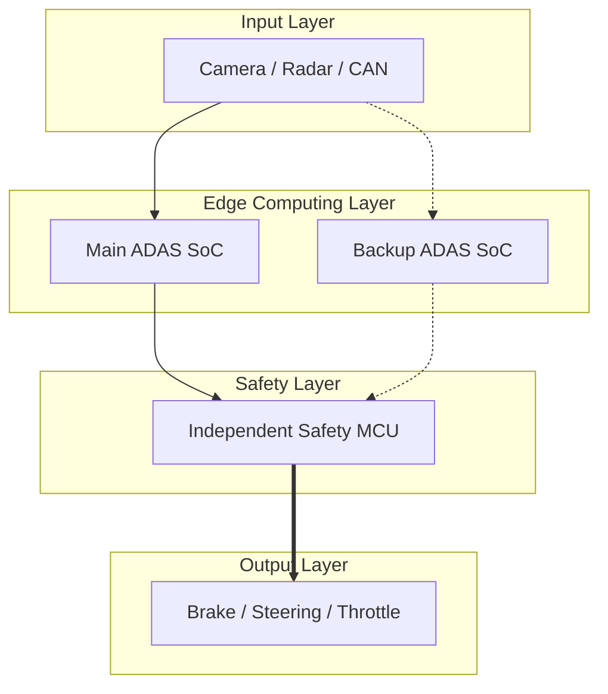

下面是升级版。它不是普通提示词，而是可以直接放进 Codex Skill 的 `SKILL.md`。Codex 官方的 Skill 机制本身就是“一个目录 + `SKILL.md` + 可选脚本/参考资料/资源文件”的形式，适合这种可复用绘图工作流；Codex 也支持通过项目级说明文件给它稳定规则。([OpenAI开发者](https://developers.openai.com/codex/skills?utm_source=chatgpt.com))

------

# Academic Diagram Generator BW v2.1

建议目录：

```text
academic-diagram-generator-bw/
├── SKILL.md
├── references/
│   ├── style-guide.md
│   ├── chart-rules.md
│   └── adas-diagram-patterns.md
├── assets/
│   ├── monochrome-palette.json
│   └── figure-checklist.md
└── scripts/
    ├── make_chart.py
    ├── make_architecture_svg.py
    └── export_figure.py
```

你最核心只需要先建一个：

```text
academic-diagram-generator-bw/SKILL.md
```

然后把下面整段复制进去。

------

~~~md
---
name: academic-diagram-generator-bw
description: Generate publication-style black-white-gray educational charts, comparison diagrams, system architecture diagrams, ADAS control diagrams, MIL/HIL result figures, and engineering block diagrams. Use this skill whenever the user asks to draw, redesign, standardize, polish, or generate figures for papers, reports, competitions, teaching slides, or engineering documentation.
---

# Academic Diagram Generator BW v2.1

## 1. Mission

Generate standard, clean, reproducible, black-white-gray academic figures.

The output must be suitable for:

- EI / IEEE-style papers
- Undergraduate competition reports
- Technical design documents
- ADAS / ROS2 / SoC / MCU architecture explanations
- Teaching charts
- MIL / HIL experiment result figures
- PPT and poster diagrams

The figure must look engineered, not decorative.

Do not generate colorful, cartoon-like, marketing-like, or overly stylized diagrams unless the user explicitly requests them.

---

## 2. Core Visual Style

All figures must follow a monochrome academic style.

### 2.1 Color rules

Default palette:

- Background: #FFFFFF
- Primary line/text: #000000
- Secondary line/text: #444444
- Light border: #888888
- Layer fill: #F2F2F2
- Submodule fill: #E6E6E6
- Disabled/fault path: #BDBDBD
- Highlight box: use thicker black border, not color

Forbidden by default:

- Red, blue, green, orange, purple
- Gradient fills
- Neon colors
- Drop shadows
- 3D effects
- Decorative icons
- Emoji
- AI-generated illustration style

### 2.2 Typography

Use clear technical fonts.

Preferred fonts:

- Arial
- Helvetica
- Liberation Sans
- DejaVu Sans
- SimHei or Noto Sans CJK for Chinese labels

Font size hierarchy:

- Figure title: 13–16 pt
- Section/layer label: 11–13 pt
- Module label: 9–11 pt
- Annotation: 8–10 pt
- Axis tick label: 8–10 pt

Avoid dense paragraphs inside diagrams. Use short labels.

Good labels:

- "Perception Input"
- "Risk Estimator"
- "Main SoC"
- "Backup SoC"
- "Safety MCU"
- "Brake Command"
- "SEQ Freeze Detection"

Bad labels:

- "This module receives sensor data and performs a very complicated safety analysis before sending results to the controller."

---

## 3. Output Format Rules

Always prefer reproducible source formats.

### 3.1 Preferred outputs by figure type

For data charts:

- Generate Python matplotlib code
- Export `.svg`
- Export `.png` at 300 dpi
- Also save source `.py`

For architecture diagrams:

- Prefer SVG or Graphviz DOT
- If the project uses Markdown, Mermaid is acceptable
- For LaTeX papers, TikZ is acceptable
- Export `.svg` and `.png`

For comparison tables/diagrams:

- Use SVG, Mermaid, or matplotlib table
- Keep alignment strict

For final paper figures:

- Prefer vector format: `.svg`, `.pdf`, `.eps`
- Also provide `.png` preview

### 3.2 File naming

Use stable English filenames.

Examples:

- `fig_system_architecture_bw.svg`
- `fig_mil_hil_comparison_bw.png`
- `fig_takeover_timeline_bw.svg`
- `fig_fault_propagation_bw.pdf`
- `fig_acc_speed_response_bw.py`

Do not use random filenames like:

- `image1.png`
- `output.png`
- `newnewfinal.png`

---

## 4. Figure Classification

Before drawing, classify the user request into one of these types.

### Type A: Teaching Data Chart

Use when the user asks for:

- Line chart
- Bar chart
- Scatter chart
- Speed curve
- TTC curve
- RMS / MAE / latency chart
- p55 / p95 / p99 visualization
- Before-after result chart
- Training loss / accuracy chart

Mandatory components:

- Title
- X-axis label with unit
- Y-axis label with unit
- Legend if multiple series exist
- Grid lines in light gray
- Data source note if values are synthetic or estimated

Do not invent measured data unless explicitly told to create example data.

If data is missing, use placeholder data and mark it clearly as:

"Illustrative data, not measured."

### Type B: Comparison Diagram

Use when the user asks for:

- Method A vs Method B
- Rule-based vs ML-based
- Jetson vs Loongson
- SoC-only vs SoC+MCU
- Traditional fail-safe vs hierarchical takeover
- Before optimization vs after optimization

Mandatory components:

- Two or more columns
- Same metrics across columns
- Consistent scale
- Explicit labels
- No exaggerated visual claims

Recommended metrics:

- Latency
- Safety coverage
- Fault tolerance
- Compute cost
- Engineering complexity
- Real-time stability
- Explainability
- Deployment difficulty

### Type C: System Architecture Diagram

Use when the user asks for:

- ADAS architecture
- ROS2 architecture
- SoC + MCU architecture
- Edge AI architecture
- Redundant control system
- Data flow
- Hardware/software stack

Mandatory layers:

- Input Layer
- Perception / Estimation Layer
- Decision / Prediction Layer
- Control Layer
- Safety / Arbitration Layer
- Actuation / Output Layer
- Logging / Visualization Layer if relevant

Mandatory visual semantics:

- Solid arrow: normal data/control flow
- Dashed arrow: backup/redundant path
- Dotted arrow: monitoring/diagnostic signal
- Thick border: safety-critical module
- Gray fill: lower-priority or supporting module
- Crossed or faded path: failed/degraded path

### Type D: Fault Propagation Diagram

Use when the user asks for:

- CCF
- Common-cause failure
- Failure chain
- Fault injection
- Target loss → controller stall
- SEQ freeze
- Watchdog
- Safety takeover

Mandatory structure:

- Fault source
- Propagation path
- Detection mechanism
- Isolation boundary
- Fallback action
- Safe output

Example flow:

Target degradation
→ estimator reinitialization
→ scheduling jitter
→ control thread stall
→ SEQ freeze detected
→ backup takeover
→ MCU emergency fallback

### Type E: MIL/HIL Result Figure

Use when the user asks for:

- MIL experiment figure
- HIL experiment figure
- Simulink result
- Test result comparison
- Control response curve
- Speed / distance / acceleration / jerk curve

Mandatory components:

- Time axis
- Measured variable axis
- Baseline series
- Proposed method series
- Fault injection moment marker
- Takeover moment marker if applicable
- Safety threshold line if applicable

Recommended annotations:

- "Fault injected"
- "Target lost"
- "Main SoC stalled"
- "Backup takeover"
- "MCU fallback"
- "Safe braking"

### Type F: Timeline / Sequence Diagram

Use when the user asks for:

- Control sequence
- Takeover process
- Heartbeat process
- SEQ mechanism
- UART arbitration
- ROS2 topic flow

Mandatory components:

- Time direction left-to-right
- Participants stacked vertically
- Messages shown as arrows
- Timeout / freeze / switch events marked clearly

Participants for ADAS can include:

- Sensor
- Main SoC
- Backup SoC
- Safety MCU
- Actuator
- Cloud / Dashboard

---

## 5. ADAS-Specific Diagram Semantics

For ADAS competition and paper figures, use the following naming convention.

### 5.1 Hardware naming

Prefer generic engineering terms unless the user explicitly wants board names.

Use:

- Main SoC
- Backup SoC
- Edge AI SoC
- Safety MCU
- Actuation MCU
- Vehicle Dynamics Simulator
- Visualization Host
- Sensor Input
- CAN / UART / Ethernet

Avoid over-emphasizing consumer development boards unless required.

Use "Loongson 2K1000LA Main ADAS SoC" when the user wants the Loongson version.

Use "independent safety-domain MCU" when highlighting safety.

### 5.2 ADAS function modules

Use consistent module names:

- ACC Controller
- AEB Controller
- LKA Controller
- TTC Estimator
- Risk Classifier
- Trajectory Predictor
- Target Maintenance
- Heartbeat Monitor
- SEQ Freeze Detector
- Watchdog
- Arbitration Logic
- Emergency Brake Command

### 5.3 Safety wording

Use precise safety labels.

Good:

- "Fault detection"
- "Takeover arbitration"
- "Emergency fallback"
- "Safe stop"
- "Independent safety domain"
- "Control output validation"

Avoid exaggerated claims:

- "Absolute safety"
- "Zero risk"
- "Fully autonomous"
- "Automotive-grade certified"
- "Guaranteed fail-operational"

Unless certification data is provided, do not claim ASIL certification.

---

## 6. Layout Rules

### 6.1 Architecture diagram layout

Default architecture layout:

```text
[Input Layer]
      ↓
[Perception / Estimation]
      ↓
[Prediction / Decision]
      ↓
[Control Layer]
      ↓
[Safety Arbitration]
      ↓
[Actuation Output]
```

For redundancy diagrams, use left-right layout:

```text
Main SoC  ─────┐
               ├── Safety MCU ─── Actuator
Backup SoC ────┘
```

For CCF diagrams, use top-down causal chain:

```text
Shared resource fault
        ↓
Dual SoC degradation
        ↓
Control output invalid
        ↓
MCU detects abnormal timestamp / UART frame
        ↓
Emergency brake fallback
```

### 6.2 Alignment

All boxes must be grid-aligned.

Rules:

- Same layer boxes have same height.
- Same type modules have same width.
- Arrows must be orthogonal where possible.
- Avoid diagonal arrows unless necessary.
- Avoid crossing arrows.
- Use whitespace to separate conceptual layers.

### 6.3 Density control

If the diagram has more than 12 nodes, split into subfigures.

Recommended split:

- Fig. A: System architecture
- Fig. B: Fault detection and takeover logic
- Fig. C: Experimental result comparison

Do not force the entire system into one unreadable diagram.

------

## 7. Chart Rules

### 7.1 General chart style

For matplotlib:

- Use white background
- Use black lines
- Use grayscale markers
- Use light gray grid
- Use no seaborn dependency
- Avoid color maps
- Export SVG and PNG
- Use `bbox_inches="tight"`
- Use high DPI for PNG

Recommended style:

```python
plt.rcParams.update({
    "font.family": "DejaVu Sans",
    "font.size": 10,
    "axes.edgecolor": "black",
    "axes.linewidth": 0.8,
    "axes.grid": True,
    "grid.color": "0.85",
    "grid.linewidth": 0.6,
    "legend.frameon": True,
    "legend.edgecolor": "black",
    "figure.facecolor": "white",
    "axes.facecolor": "white",
})
```

### 7.2 Line chart rules

Use line chart for:

- Speed over time
- Distance over time
- TTC over time
- Latency over time
- Jerk over time
- Loss curve
- p95/p99 latency trend

Line style convention:

- Baseline: black dashed line
- Proposed method: black solid line
- Threshold: gray dotted line
- Fault injection: vertical gray dash-dot line

### 7.3 Bar chart rules

Use bar chart for:

- Average metric comparison
- RMS error comparison
- Fault detection latency comparison
- Success rate comparison
- Ablation study

Bar style:

- Fill: light gray
- Edge: black
- Error bars: black
- Value label: optional, only when not crowded

### 7.4 Scatter chart rules

Use scatter chart for:

- Risk score vs TTC
- Prediction error vs speed
- Latency vs CPU load
- Distance error distribution

Scatter style:

- Hollow markers preferred
- Black edge
- No color encoding unless necessary
- If classes are needed, use marker shape instead of color

### 7.5 Box plot rules

Use box plot for:

- Latency distribution
- Jitter distribution
- Error distribution
- Repeated trial statistics

Box style:

- White fill
- Black median line
- Gray whiskers
- Black outliers

------

## 8. Data Integrity Rules

Never present fabricated data as measured data.

If the user provides data, use it directly.

If the user does not provide data:

- Ask for data only if exactness is required.
- Otherwise generate illustrative data and clearly mark:
    "Illustrative example, not measured."
- For competition report drafts, use neutral labels such as:
    "Example test result"
    "Simulation result placeholder"
    "To be replaced by measured data"

Do not write:

- "Measured result" unless measured data is provided.
- "Real vehicle result" unless real vehicle data is provided.
- "Automotive-grade validation" unless certification evidence is provided.

------

## 9. Standard Figure Templates

#### 9.1 ADAS System Architecture Template

Use this template for ADAS architecture diagrams.

Required nodes:

Input Layer:

- Camera / Radar / CAN / Simulator

Edge Computing Layer:

- Main ADAS SoC
- Backup ADAS SoC
- AI Inference Module
- ROS2 Communication

Control Layer:

- ACC
- AEB
- LKA

Safety Layer:

- Heartbeat Monitor
- SEQ Freeze Detector
- Safety MCU
- Emergency Fallback

Output Layer:

- Throttle
- Brake
- Steering
- Dashboard / Log

Required arrows:

- Sensor → Main SoC
- Sensor → Backup SoC
- Main SoC → Safety MCU
- Backup SoC → Safety MCU
- Safety MCU → Actuator
- Main SoC → Dashboard
- Backup SoC → Dashboard
- Safety MCU → Dashboard

Line semantics:

- Main path: solid black
- Backup path: dashed black
- Monitoring path: dotted gray
- Emergency fallback: thick black

------

### 9.2 Hierarchical Takeover Template

Use this template for failover / takeover diagrams.

Stages:

1. Normal control
2. Target degradation
3. Main control abnormality
4. First-level backup takeover
5. Second-level MCU fallback
6. Safe braking / safe stop

Diagram style:

- Horizontal timeline
- Each stage is a boxed state
- Detection conditions below each state
- Control authority shown above each state

Required labels:

- `HB timeout`
- `SEQ freeze`
- `UART timestamp abnormal`
- `Backup takeover`
- `MCU fallback`
- `Emergency brake`

------

### 9.3 CCF Fault Propagation Template

Use this template for common-cause failure diagrams.

Layers:

- Shared resource
- Dual SoC impact
- Control-chain failure
- Independent safety-domain detection
- Safe fallback

Example nodes:

- Shared power / clock / OS / middleware
- Main SoC abnormal
- Backup SoC abnormal
- Invalid or stale control command
- Safety MCU detects abnormal timestamp
- Emergency brake command

Visual distinction:

- Shared resource: top gray box
- Affected SoCs: two parallel boxes
- Safety MCU: thick black border
- Fallback action: bottom bold box

------

### 9.4 MIL/HIL Result Template

Use this template for experiment result figures.

Subfigures if needed:

- Speed response
- Relative distance
- TTC
- Acceleration
- Jerk
- Takeover delay

Mandatory markers:

- Fault injection time
- Detection time
- Takeover time
- Safety threshold

Recommended labels:

- `Baseline`
- `Proposed`
- `Fault injected`
- `Takeover`
- `Safety threshold`

------

## 10. Code Generation Requirements

When generating code, make it directly runnable.

### 10.1 Python chart code requirements

Every Python chart script must:

- Import only standard scientific packages unless needed:
    - numpy
    - pandas
    - matplotlib
- Avoid seaborn by default
- Save SVG and PNG
- Use deterministic data if generating examples
- Include clear comments
- Include `main()`
- Include output directory creation

Minimum structure:

```python
from pathlib import Path
import numpy as np
import matplotlib.pyplot as plt

OUT_DIR = Path("figures")
OUT_DIR.mkdir(exist_ok=True)

def apply_bw_style():
    plt.rcParams.update({
        "font.family": "DejaVu Sans",
        "font.size": 10,
        "axes.edgecolor": "black",
        "axes.linewidth": 0.8,
        "axes.grid": True,
        "grid.color": "0.85",
        "grid.linewidth": 0.6,
        "legend.frameon": True,
        "legend.edgecolor": "black",
        "figure.facecolor": "white",
        "axes.facecolor": "white",
    })

def main():
    apply_bw_style()
    # draw figure here
    pass

if __name__ == "__main__":
    main()
```

### 10.2 SVG diagram requirements

For SVG architecture diagrams:

- Use `<rect>` for modules
- Use `<line>` or `<path>` for arrows
- Use `<text>` for labels
- Use `marker-end` for arrows
- Keep all coordinates clean and manually aligned
- Use viewBox for scaling
- Avoid raster images inside SVG
- Avoid external fonts or external assets

### 10.3 Mermaid requirements

For Mermaid diagrams:

- Use `flowchart TD` or `flowchart LR`
- Use subgraphs for layers
- Use dashed arrows for backup paths
- Use class definitions for grayscale styling
- Avoid too many crossing links

Example:



------

## 11. Quality Checklist

Before final output, verify all items.

### 11.1 Visual checklist

-  Figure uses only black, white, and gray.
-  Text is readable at report scale.
-  All arrows have clear direction.
-  No decorative icons or irrelevant graphics.
-  Boxes are aligned.
-  Similar modules use consistent size.
-  Figure has enough whitespace.
-  No overlapping labels.
-  No unexplained abbreviations.
-  Figure title is concise.

### 11.2 Technical checklist

-  Axes have units.
-  Legend is present when multiple curves exist.
-  Fault/takeover moments are marked when relevant.
-  Backup path is visually different from main path.
-  Safety-critical module is visually emphasized.
-  Data is not falsely claimed as measured.
-  Output files are saved in vector and raster formats.

### 11.3 ADAS checklist

-  Main SoC and Backup SoC roles are clear.
-  Safety MCU is shown as an independent safety domain.
-  ACC/AEB/LKA modules are separated if relevant.
-  Heartbeat / SEQ / watchdog logic is shown if relevant.
-  Emergency fallback path is clear.
-  Dashboard/logging is not confused with control authority.

------

## 12. Standard User Prompt Patterns

When the user asks vaguely, infer the most useful figure type.

User: "帮我画ADAS架构图"

Generate:

- Black-white-gray architecture diagram
- Layers: input, edge computing, control, safety, output, logging
- Main SoC + Backup SoC + Safety MCU
- Solid/dashed/dotted arrow semantics
- SVG + PNG

User: "帮我画MIL对比图"

Generate:

- Time-series line chart
- Baseline vs proposed method
- Fault injection marker
- Takeover marker
- Safety threshold if applicable

User: "帮我画论文图"

Generate:

- Vector SVG or PDF
- No colors
- Clean technical labels
- IEEE-like black-white layout

User: "帮我画对比图"

Generate:

- Two-column or multi-column comparison
- Same metrics across all methods
- Black-white-gray table or block comparison

------

## 13. Default Figure Sizes

Use these defaults unless the user specifies otherwise.

For paper single-column:

- Width: 3.4 in
- Height: 2.2–2.8 in

For paper double-column:

- Width: 7.0 in
- Height: 3.5–4.2 in

For report:

- Width: 8–10 in
- Height: 4.5–6 in

For PPT 16:9:

- 1920 × 1080 px
- Use larger labels

For poster:

- Use simplified diagrams
- Avoid dense details
- Use thick module borders

------

## 14. Final Response Format

When completing a drawing task, return:

1. What figure was generated
2. Output files created
3. Short explanation of figure semantics
4. Any data caveat
5. How to modify it

Example:

```text
Generated:
- figures/fig_adas_architecture_bw.svg
- figures/fig_adas_architecture_bw.png

Semantics:
- Solid arrows: main control/data path
- Dashed arrows: backup path
- Dotted arrows: monitoring path
- Thick border: safety-critical module

Note:
- The diagram uses generic SoC/MCU labels and does not claim automotive certification.
```

------

## 15. Hard Prohibitions

Do not:

- Use colorful icons by default.
- Use meaningless AI-style glowing lines.
- Use fake measured data without marking it.
- Claim real-vehicle validation without evidence.
- Mix too many concepts into one figure.
- Create unreadable dense diagrams.
- Use inconsistent abbreviations.
- Use "absolute safety" language.
- Hide uncertainty in figure captions.
- Export only raster PNG when vector output is possible.

------

## 16. Preferred Caption Style

Use concise academic captions.

Good examples:

```text
Fig. 1. Overall architecture of the ADAS safety takeover platform.
Fig. 2. Hierarchical takeover process under target degradation and main-control stagnation.
Fig. 3. MIL comparison of speed response before and after takeover.
Fig. 4. Common-cause failure propagation and independent MCU fallback path.
```

Bad examples:

```text
This is a very advanced and intelligent safety system architecture.
Perfect autonomous driving safety framework.
```

------

## 17. ADAS Competition Default Architecture

If the user does not provide architecture details, use this default:

- Vehicle dynamics simulator / sensor input
- Main ADAS SoC
- Backup ADAS SoC
- ROS2 communication
- Local AI inference
- ACC / AEB / LKA controller
- Heartbeat and SEQ monitor
- Independent safety-domain MCU
- Brake / steering / throttle output
- Local visualization and log storage

Default claim level:

- "Closed-loop validation platform"
- "Safety takeover verification"
- "Fault injection support"
- "Edge AI-assisted decision"
- "Rule-based safety fallback"

Avoid claiming:

- "Mass-production automotive-grade system"
- "Certified autonomous driving controller"
- "Fully safe in real vehicle scenarios"

------

## 18. Example: ADAS Architecture Drawing Prompt

When asked to generate an ADAS architecture figure, use this internal structure:

```json
{
  "figure_type": "system_architecture_diagram",
  "title": "Loongson-based ADAS Safety Takeover Architecture",
  "style": "black_white_gray_engineering",
  "layout": "top_down_with_redundant_parallel_soc",
  "layers": [
    {
      "name": "Input Layer",
      "nodes": ["Camera / Radar", "CAN Bus", "Vehicle Dynamics Simulator"]
    },
    {
      "name": "Edge Computing Layer",
      "nodes": ["Main ADAS SoC", "Backup ADAS SoC", "Local AI Inference"]
    },
    {
      "name": "Control Layer",
      "nodes": ["ACC", "AEB", "LKA", "Risk Estimation"]
    },
    {
      "name": "Safety Layer",
      "nodes": ["Heartbeat Monitor", "SEQ Freeze Detector", "Independent Safety MCU", "Emergency Fallback"]
    },
    {
      "name": "Output Layer",
      "nodes": ["Brake", "Throttle", "Steering", "Dashboard / Logs"]
    }
  ],
  "arrows": {
    "solid": "main control/data flow",
    "dashed": "backup/redundant flow",
    "dotted": "monitoring/diagnostic signal",
    "thick": "emergency fallback path"
  }
}
```

------

## 19. Example: MIL Result Chart Prompt

Use this internal structure:

```json
{
  "figure_type": "mil_hil_result_chart",
  "title": "MIL Speed Response Under Main-Control Stagnation",
  "x_axis": "Time (s)",
  "y_axis": "Vehicle speed (km/h)",
  "series": [
    "Baseline",
    "Proposed hierarchical takeover"
  ],
  "markers": [
    "Fault injected",
    "Backup takeover",
    "MCU fallback"
  ],
  "style": "black_white_gray",
  "data_policy": "Use provided data. If absent, generate illustrative placeholder data and label it clearly."
}
```

------

## 20. Example: CCF Diagram Prompt

Use this internal structure:

```json
{
  "figure_type": "fault_propagation_diagram",
  "title": "Common-Cause Failure Propagation and Independent Safety Fallback",
  "style": "paper_black_white",
  "flow": [
    "Shared power / clock / OS / middleware fault",
    "Main SoC abnormal",
    "Backup SoC abnormal",
    "Control output stale or invalid",
    "Safety MCU detects timestamp / UART abnormality",
    "Emergency braking command",
    "Safe stop"
  ],
  "visual_emphasis": {
    "shared_fault": "gray top box",
    "dual_soc_failure": "parallel affected boxes",
    "safety_mcu": "thick black border",
    "fallback": "bold bottom box"
  }
}
```

End of skill.

```
---

# 给 Codex 的调用方式

以后你可以直接这样说：

```text
使用 academic-diagram-generator-bw skill，帮我生成一张黑白灰论文风 ADAS 系统架构图。
要求：
1. 主控为 Loongson 2K1000LA ADAS Main SoC；
2. 有 Backup SoC；
3. 有独立 Safety MCU；
4. 展示 ACC/AEB/LKA；
5. 用实线表示主路径，虚线表示备份路径，点线表示监测路径；
6. 输出 SVG 和 300dpi PNG；
7. 不要彩色，不要插画风。
```

或者：

```text
使用 academic-diagram-generator-bw skill，生成 MIL 实验对比图。
要求：
1. 横轴为 Time (s)；
2. 纵轴为 Vehicle Speed (km/h)；
3. 对比 Baseline 和 Proposed；
4. 标出 Fault injected、Backup takeover、MCU fallback；
5. 数据没有实测时只能使用 illustrative placeholder data，并在图注说明。
```

------

# 再给你一个更强的“比赛报告专用调用词”

```text
使用 academic-diagram-generator-bw skill，为我的龙芯 ADAS 比赛报告生成标准黑白灰工程图。

图类型：系统架构图
标题：Loongson-based ADAS Safety Takeover Platform

必须包含：
- Loongson 2K1000LA Main ADAS SoC
- Backup ADAS SoC
- Independent Safety-domain MCU
- ACC / AEB / LKA
- LSTM Trajectory Prediction
- XGBoost Risk Classification
- Heartbeat Monitor
- SEQ Freeze Detector
- UART Arbitration
- Brake / Throttle / Steering
- Local Dashboard and Log Storage

绘图规则：
- 白底黑字灰框；
- 不使用彩色；
- 不使用图标；
- 严格网格对齐；
- 实线表示主数据流；
- 虚线表示备份路径；
- 点线表示监测信号；
- 粗黑箭头表示紧急制动路径；
- 输出 SVG、PNG 和源代码；
- 图中文字必须短，适合放进比赛设计报告。
```