# 基于龙芯 2K1000LA的边缘AI智能驾驶与主备冗余安全控制系统

基于 Simulink/MATLAB 与 CARLA 联合仿真、龙芯 2K1000LA SoC 本地机器学习与独立 MCU 安全仲裁的硬件在环平台

---

## 摘要

在智能网联汽车与高级驾驶辅助系统快速发展的背景下，ADAS 控制器在真车部署前的安全验证需求日益突出。车道保持、自适应巡航和自动紧急制动等功能不仅要求算法本身能够稳定运行，还要求系统在主控失效、通信异常、目标状态突变和执行链路异常时仍具备可接管、可仲裁、可追溯的安全闭环能力。传统 ADAS 验证方式多依赖单机仿真、离线算法测试或场景动画演示，难以同时证明实时控制连续性、执行端可信性和智能辅助边界，容易出现“仿真可运行、硬件不可核验、异常不可复盘”的问题。

针对上述问题，本作品构建了一套基于 Simulink/MATLAB＋CARLA 联合仿真、龙芯 2K1000LA 边缘计算、Jetson Nano 热备冗余和 FreeRTOS Safety MCU 独立仲裁的 ADAS 硬件在环验证平台。系统覆盖车道保持（LKA）、自适应巡航（ACC）和自动紧急制动（AEB）三类核心功能，并将静止前车、超车绕行、相邻车道加塞、行人横穿、主控失效和双路失效等工况纳入统一的故障注入与日志复盘口径。Simulink/MATLAB 负责车辆动力学与控制律建模，CARLA 负责三维交通场景和感知真值生成，龙芯 2K1000LA SoC 作为第一控制节点以 100 Hz 运行 LKA/ACC/AEB 控制内核，并承担本地机器学习辅助分析、KPI 统计和运行日志留存；Jetson Nano 作为热备冗余与边缘辅助节点，负责主控心跳监听、备路控制帧输出、MQTT 上云和非实时展示服务；FreeRTOS Safety MCU 位于最靠近执行端的位置，完成主、备两路控制帧的 CRC 校验、时间新鲜度判断、来源仲裁、AEB 硬件地板和通信看门狗兜底。

在安全机制方面，本作品形成三项核心创新。第一，提出基于 SEQ 心跳与控制状态种子继承的主备无感接管机制，同时检测通信静默和控制周期停滞，并在备控接管时继承主控最近一帧转向、纵向加速度和 AEB 状态，解决主控假活、备控帧未就绪和接管首帧突变问题。第二，将最终执行裁决从上位 Linux/ROS2 控制节点下沉到独立 FreeRTOS MCU，使错误帧丢弃、主控失效切换备控、双路失效安全制动均可由 MCU 状态和控制源日志复查，避免控制安全完全依赖单一 SoC 或单一进程。第三，实现规则控制与机器学习的受约束融合：Class-Aware AEB 保持目标类别判定的可解释性，ACC 接近速度门控抑制静止前车误触发，ACC-LSTM、AEB-LSTM 与 XGBoost 等轻量模型用于临界风险预警和 KPI 复盘，但机器学习输出只允许向更保守方向参与协同仲裁，不能放松规则 AEB、主备冗余、通信看门狗或 MCU AEB 硬件地板。

实测结果表明，系统在功能运行、冗余接管和执行安全方面均形成可复现实验证据。用真实 SOCCode 控制内核在纯 SIL 高速弯道上重新扫描（每点 6 次随机扰动重复试验取平均），车道保持横向控制器的开环稳定边界由早期约 78 km/h 刷新到约 108 km/h（RMS≤0.5 m 判据），且扫至 144 km/h 仍不发散、始终在车道内；启用弯道前瞻限速后，目标车速扫至 144 km/h（本次扫描上限）仍全程车道有界（RMS≈0.13 m，进弯自动降速）；接近静止前车场景中，AEB 误触发由基线 57 次降为 0 次；加塞场景中，规则 AEB 未触发时机器学习风险峰值可达约 0.99，具备临界风险预警能力；主备接管空窗由原基线约 557 ms 降至 SEQ 接管约 156 ms，并在热待机与时序协同优化后达到典型约 47 ms；110 次主备接管极限扫描全程 0 碰撞，最小稳定配置达到心跳 33 ms / MCU 仲裁 52 ms；双路失效时 MCU 可在约 200 ms 量级进入安全制动。结果说明，本平台不仅能够展示 ADAS 功能效果，还能够验证控制连续性、执行端可信性、智能辅助边界和故障响应能力，具备面向真实车辆控制器迁移前开展工程验证的基础。

---

## 第一部分　作品概述

### 1.1　功能与特性

本作品面向道路车辆 ADAS 的开发、验证与真车迁移前安全评估，构建了一套由 Simulink/MATLAB＋CARLA 联合仿真、龙芯 2K1000LA 主控 SoC、Jetson Nano 副控 SoC 和 FreeRTOS Safety MCU 组成的双冗余安全控制系统。系统不是单纯展示车辆动画，而是围绕“控制是否闭环、接管是否连续、执行是否可信、数据是否可复盘”四个验收目标，将 ADAS 功能运行、故障注入、安全仲裁和日志分析纳入同一条验证链路。

系统具备三类核心控制功能：车道保持（LKA）、自适应巡航（ACC）和自动紧急制动（AEB）。LKA 负责横向车道中心跟踪、航向误差修正和弯道稳定控制；ACC 负责目标速度跟踪、前车距离保持和接近速度约束；AEB 负责在碰撞风险升高时触发分级制动，并在必要时覆盖普通纵向控制。三类功能运行在同一套控制栈中，输出统一进入协同仲裁流程，避免横向、纵向和紧急制动逻辑相互割裂。

系统覆盖三类典型危险工况：静止前车超车绕行、相邻车道加塞避让和行人横穿制动。每类工况均可在 CARLA 场景中复现，并通过车辆轨迹、目标状态、控制命令、AEB 触发状态和仲裁来源进行核验。评审时不仅可以观察仿真画面，还可以按时间轴复查系统在目标识别、风险判断、控制输出和最终执行之间的对应关系。

系统具备主备冗余与执行安全兜底能力。龙芯 2K1000LA 作为第一控制节点，负责 100 Hz LKA/ACC/AEB 实时控制、本地机器学习辅助分析、KPI 统计和日志留存；Jetson Nano 作为热备冗余与边缘辅助节点，负责监听主控心跳、接收 SEQ 序号和控制状态种子，并在主控静默、进程退出或控制周期停滞时输出备路控制帧；FreeRTOS Safety MCU 位于最靠近执行端的位置，对主、备两路控制帧执行 CRC 校验、时间新鲜度判断、来源仲裁、AEB 硬件地板和通信看门狗兜底。主控失效、SEQ 停滞、错误帧、双路失效等异常均可通过故障注入触发，并由 SRC0/SRC1/SRC9 状态、控制帧日志和 MCU 仲裁记录验证。

系统还具备边缘智能辅助能力。龙芯 SoC 在实时控制同时运行 ACC-LSTM、AEB-LSTM、XGBoost 等轻量模型，用于前车接近趋势分析、碰撞风险评估、加塞等临界场景预警和 KPI 复盘。机器学习输出只作为保守增强信号参与上层协同仲裁，不能放松规则 AEB、主备冗余、通信看门狗或 MCU AEB 硬件地板，从而保证智能判险不越过安全边界。

综上，本作品的核心特性在于把“联合仿真输入、实时控制决策、主备接管、MCU 执行仲裁、机器学习辅助分析和运行证据复盘”整合为一条可验证链路。系统既能展示 LKA/ACC/AEB 的功能效果，也能验证异常条件下的控制连续性、执行可信性和智能辅助边界。

### 1.2　应用领域

本系统面向道路车辆 ADAS 控制器的开发、验证与真车迁移前风险排查，适用于车道保持（LKA）、自适应巡航（ACC）、自动紧急制动（AEB）等辅助驾驶功能的算法迭代、闭环联调和安全验证。系统以 Simulink/MATLAB＋CARLA 联合仿真作为被控对象与场景输入，以龙芯 2K1000LA SoC 作为边缘控制与分析平台，以主备冗余 SoC 和独立 Safety MCU 作为安全接管与执行仲裁链路，可用于在真实车辆部署前检查控制策略、通信协议、执行逻辑和异常保护机制是否完整。

在工程开发场景中，本系统可服务于基于模型的设计（MBD）流程：Simulink/MATLAB 用于车辆动力学、控制律和执行响应建模，CARLA 用于构建道路、车辆、行人、加塞、静止障碍物等高风险交通场景，二者联合提供可重复的测试输入。开发者可在不上真车的条件下反复验证急刹、目标丢失、主控失效、通信中断、双路失效等危险工况，降低早期算法调试和安全策略验证的成本与风险。

在安全验证场景中，本系统不仅关注 ADAS 功能是否能够正常运行，还关注异常发生后控制链路是否可接管、执行端是否可信、机器学习辅助是否越界。通过主备心跳、SEQ 停滞检测、控制状态继承、CRC 校验、来源仲裁、AEB 硬件地板和通信看门狗等机制，系统能够对控制连续性、冗余接管能力、执行安全边界和故障响应时序进行核验。所有关键结果均可由控制帧、故障日志、KPI 曲线和复现实验追溯，适合用于 ADAS 原型系统评审、硬件在环测试、教学实验和竞赛展示。

### 1.3　主要技术特点

围绕真车 ADAS 的安全接管与可靠性需求，本作品采用“**Simulink/MATLAB＋CARLA 联合仿真 + ROS2 分布式通信与控制调度 + 双 SoC 冗余实时计算 + 独立安全域 MCU 仲裁执行**”的多层纵深架构，构建覆盖车辆建模、环境感知、控制决策、通信交互、冗余接管与执行反馈的硬件在环闭环系统。

其中，Simulink/MATLAB 与 CARLA 构成联合仿真层：Simulink/MATLAB 负责车辆动力学与控制律建模（MBD），CARLA 负责高保真三维交通场景构建、道路环境复现与感知真值生成，二者按 20 Hz 同步步进运行，为 ADAS 控制算法提供连续、可复现的车辆状态与交通场景输入。ROS2 作为系统级通信与调度框架，负责各功能节点之间的消息发布、状态同步、控制指令传递与故障信息上报，使仿真环境、主备控制器与安全仲裁单元形成统一的数据交互链路。

在实时计算层，主、备 SoC 以 100 Hz 运行同一套 LKA/ACC/AEB 控制内核，与 Simulink/MATLAB＋CARLA 联合仿真环境通过实时帧闭环交互，分别承担主控决策、备控热备、状态监测与冗余接管任务。在安全执行层，独立安全域 MCU 运行 FreeRTOS，不依赖上层操作系统与 ROS2 通信栈，逐项实现 CRC 校验、控制源仲裁、AEB 硬件地板、通信看门狗与安全制动执行，使系统在迁移真车前即可完成“仿真建模—ROS2 通信调度—主备冗余计算—MCU 安全仲裁—执行反馈”的全闭环验证。

1. **控制内核复用**：同一套 LKA/ACC/AEB 逻辑用于离线回放、联合仿真与硬件部署；验收时用同一输入回放检查输出一致性，避免“仿真一套、部署一套”。
2. **龙芯边缘优先**：龙芯 2K1000LA 作为第一主控 SoC，直接运行控制管线，并在同节点完成本地机器学习小模型实时分析与 KPI 计算；验收时检查控制周期、CPU 侧日志、风险输出和 KPI 文件。
3. **主备冗余控制**：主控正常输出，备控监听心跳并在异常时无感接管；验收时通过杀进程、冻结 SEQ 和双路静默三类故障注入检查 SRC 迁移。
4. **MCU 安全下沉**：FreeRTOS MCU 独立判定控制帧有效性，通信失效或 AEB 触发时输出安全制动；验收时检查 CRC 错帧丢弃、帧超时和看门狗制动。
5. **协同仲裁防打架**：ACC/LKA/AEB 多源纵向需求按"最保守者胜 + 受控接近门控"统一仲裁；验收时用接近静止前车场景对比 AEB 误触发次数和最终停车距离。

### 1.4　主要性能指标

| 指标 | 取值 | 说明/验收方式 |
|---|---|---|
| 控制周期 | 100 Hz（约 10 ms/周期） | 实机遥测统计，硬实时预算 |
| 联合仿真输入 | 约 20 Hz | Simulink/MATLAB＋CARLA 同步步进，提供被控对象与场景真值 |
| 主备接管时间 | 可靠无感约 47 ms | 心跳超时 35 ms + MCU 主控失活仲裁 58 ms + 备控轮询 5 ms；110 次极限扫描 + 备控热待机：接管贴量化地板（最快 15 ms、中位约 47 ms）、可用段干净率 100%、>2 m/s² 冲击 0/100、0 碰撞 |
| MCU 通信兜底 | 双路静默约 200 ms 触发安全制动 | 看门狗时序 |
| 最大安全制动 | 9.99 m/s² 级 | AEB/看门狗状态 |
| AEB 误触发（接近静止前车） | 0 次（基线 57 次） | 协同仲裁+受控接近门控，实测 |
| 车道保持稳定边界 | 横向控制器开环稳定边界约 108 km/h（早期估计约 78 km/h，本次用真实控制内核刷新）；**启用弯道前瞻限速后**目标车速扫至 144 km/h（本次扫描上限）仍全程车道有界（RMS≈0.13 m，进弯自动降速） | 稳定判据：横向误差 RMS ≤0.5 m 且 ≥10 s 无发散振荡；纯 SIL 高速弯道、每点 6 次重复取平均 |
| 本地机器学习——ACC-LSTM | RMSE 0.668 m/s²，较无预测基线↓25.9% | 训练/评估对比 |
| 本地机器学习——AEB 分类 | LSTM 81.5% / XGBoost 87.1% | 交叉验证 |

### 1.5　主要创新点

1. **SEQ 心跳 + 控制状态种子继承：把主备切换从“能接管”提升为“无感接管”。**

主备接管首先要解决两个问题：一是主控完全静默，二是主控进程假活但控制序号不再推进。系统因此同时检查心跳接收间隔与 SEQ 更新时间；只要任一条件超时，就判定备控具备接管资格。

$$
\begin{aligned}
\mathrm{silent} &= (t_{now}-t_{last\_rx}) > T_{hb} \\
\mathrm{seq\_stall} &= (t_{now}-t_{last\_seq\_change}) > T_{hb} \\
\mathrm{backup\_active} &= \mathrm{silent} \lor \mathrm{seq\_stall}
\end{aligned}
$$

该公式用解释“为什么不仅看有没有心跳，还要看 SEQ 是否持续变化”。`silent` 覆盖主控掉线，`seq_stall` 覆盖主控假活，`backup_active` 是备控接管状态。评审可从心跳时间戳、SEQ 变化时间和 SRC 切换日志复算该判断。

实现上只保留接管判定与状态继承两个关键动作：判定异常后，备控不从零初始化控制器，而是继承主控最后一帧转向、加速度和 AEB 状态，避免接管首帧突变。

```python
fault = heartbeat_timeout() or seq_not_advanced()
if fault:
    backup_active = True
    seed_controller(last_primary_delta, last_primary_acc, last_primary_aeb)
    send_backup_control_frame()
```

结果：原基线只等心跳静默，接管空窗约 557 ms；加入 SEQ 停滞检测和状态继承后降至 156 ms；成对压缩心跳/MCU 仲裁阈值并开启备控热待机后，典型接管约 47 ms，接管瞬间加速度阶跃 ≤0.01 m/s²，110 次极限扫描 0 碰撞。

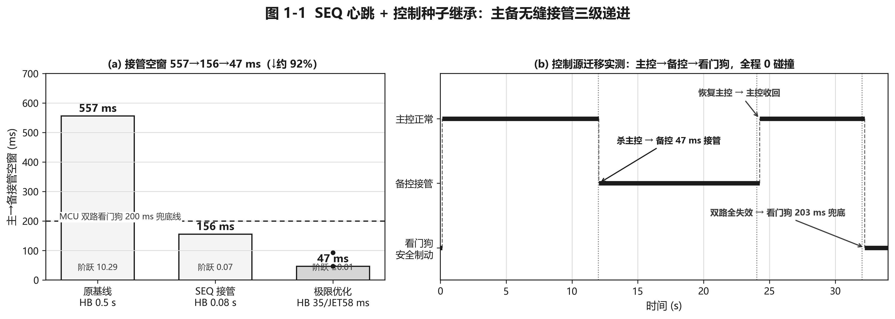

〔图 1-1　SEQ 心跳 + 控制状态种子继承的主备无缝接管证据〕

2. **MCU 三重校验 + 来源仲裁：把执行裁决下沉到独立安全域。**

执行端不能直接相信上位 SoC 的控制命令，因此 MCU 先用 CRC-8/MAXIM 检查帧内容是否被破坏。这里的多项式不是为了展示数学复杂度，而是定义控制帧校验规则，评审可用同一多项式复算错误帧是否应被丢弃。

$$
P(x)=x^8+x^5+x^4+1 \qquad (\mathrm{CRC\text{-}8/MAXIM},\ 0x31)
$$

通过 CRC 后，MCU 再按“主控优先、备控补位、双路失效安全制动”的规则选择最终来源。该分段公式对应 SRC0/SRC1/SRC9 三种日志状态。

$$
\mathrm{src}_{exec}=\begin{cases}
\mathrm{SRC0}, & \mathrm{valid}(\mathrm{SRC0}) \land \mathrm{fresh}(\mathrm{SRC0}) \\
\mathrm{SRC1}, & \neg\mathrm{fresh}(\mathrm{SRC0}) \land \mathrm{valid}(\mathrm{SRC1}) \land \mathrm{fresh}(\mathrm{SRC1}) \\
\mathrm{SRC9}, & \mathrm{otherwise}
\end{cases}
$$

最后，AEB 硬件地板在来源选择之后独立叠加。即使上位控制给出较弱制动，MCU 仍取更保守的加速度命令。

$$
a_{exec}=\min(a_{src\_exec},a_{aeb\_floor})
$$

实现上只需要保留三步：错帧丢弃、来源选择、安全地板叠加。完整 CRC 查表过程不放在报告正文中，避免代码干扰评审理解。

```python
if not crc_ok(frame):
    drop(frame)

selected = choose_fresh_source(primary, backup)  # SRC0 -> SRC1 -> SRC9
exec_acc = min(selected.acc, aeb_hardware_floor)
```

证明结果：错误帧先丢弃、过期帧不参与仲裁、主控失效切备控、双路静默进入 SRC9 看门狗安全制动。双路全失效故障注入中，MCU 约 203 ms 输出 9.99 m/s² 级安全制动，3 次重复实验 0 碰撞、最小间距 ≥52 m。

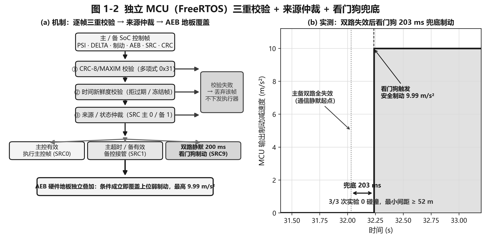

〔图 1-2　独立 FreeRTOS MCU 的 CRC / 新鲜度 / 来源仲裁 + AEB 硬件地板证据〕

3. **Class-Aware AEB + ACC/AEB 协同仲裁 + ML 保守增强：让智能判险可解释、可约束、可复算。**

AEB 判险首先用 TTC 和 DRAC 表示“多久撞上”和“需要多大减速度才能避免碰撞”。这两个量由车距和接近速度直接计算，可从日志逐帧复算，是 AEB 触发解释的基础。

$$
\begin{aligned}
\mathrm{TTC} &= \frac{d}{\max(v_{rel},\varepsilon)} \\
\mathrm{DRAC} &= \frac{v_{rel}^{2}}{2\max(d,\varepsilon)}
\end{aligned}
$$

不同目标类别采用不同触发距离、TTC 系数和确认拍数。该公式用于说明系统不是对所有目标“一刀切急刹”，而是按车辆、行人、未知目标分别确认风险，从而减少静止前车和 cut-in 场景的误触发。

$$
\begin{aligned}
\mathrm{risk}_{cls} &= (d \le D_{cls}) \lor (\mathrm{TTC} \le \tau_{cls}\mathrm{TTC}_{base}) \lor (\mathrm{DRAC} \ge a_{aeb\_min}) \\
\mathrm{AEB}_{trigger} &= \mathrm{risk}_{cls}\ \mathrm{for}\ N_{cls}\ \mathrm{frames}
\end{aligned}
$$

纵向仲裁把 ACC、AEB、行人制动、车道边界制动和机器学习预警统一成加速度候选项，取最小值即取最保守制动。机器学习只允许给出非正的附加制动，不能放宽规则控制和 MCU 安全边界。

$$
\begin{aligned}
a_{lon\_cmd} &= \min\{a_{acc},a_{aeb},a_{ped},a_{lane},a_{ml}\} \\
a_{ml} &= -K_{ml}\max(p_{risk}-p_0,0), \qquad a_{ml}\le 0
\end{aligned}
$$

实现上只保留“计算风险—多拍确认—最保守仲裁”这条主线，删除重复的阈值展开代码。

```python
risk = class_aware_risk(distance, closing_speed, object_class)
aeb_cmd = confirm_then_brake(risk)
ml_cmd = conservative_ml_brake(risk_prob)
lon_cmd = min(acc_cmd, aeb_cmd, pedestrian_cmd, lane_cmd, ml_cmd)
```

证明结果：接近静止前车同长度 480 帧实验中，AEB 误触发由 57 次降为 0 次，车辆由卡在约 17 m 改为平滑稳停约 5.94 m；加塞场景规则 AEB 未触发时，机器学习风险峰值约 0.99，作为预警和附加保守制动输入，但不能放松规则 AEB、MCU 看门狗或 AEB 硬件地板。ACC-LSTM RMSE 0.668 m/s²，较无预测基线降低 25.9%；AEB-LSTM / XGBoost 准确率分别为 81.5% / 87.1%。

与"安全方向优先"协同仲裁同源的**弯道前瞻限速**则把上述纵向保守逻辑延伸到横向稳定：进弯前按曲率预先降速，使横向控制器始终工作在裕度内。本次用真实 SOCCode 控制内核在纯 SIL 高速弯道（R=200 m）上以每点 6 次随机扰动重复试验刷新扫描，得到当前最高车速能力——**横向控制器开环稳定边界由早期约 78 km/h 提升到约 108 km/h**（RMS≤0.5 m 判据），且扫至 144 km/h 仍 0 发散、始终在车道内（|偏移|max≈0.88 m，属优雅降级而非失稳）；**启用弯道前瞻限速后目标车速扫至 144 km/h（本次扫描上限）仍全程车道有界**（RMS≈0.13 m）。详细数据与整页折线/轨迹证据见第三部分图 3-3、图 3-4。

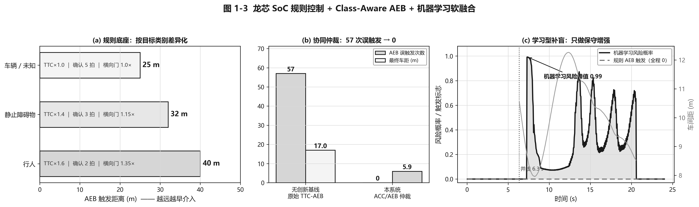

〔图 1-3　Class-Aware AEB、ACC/AEB 协同仲裁与机器学习保守增强证据〕

### 1.6　设计流程

设计流程按"需求分析→联合建模→系统分层→算法实现→硬件闭环验证"五阶段推进，每一阶段都定义可核验输出，避免只描述开发过程而缺少验收证据。

**第一阶段　需求分析。** 确定 LKA/ACC/AEB 三项核心功能与主备切换、执行仲裁、边缘复盘三项系统级需求，输出功能清单、失效模式清单和验收指标，形成面向真车的"控制—执行—复盘"链路。

**第二阶段　联合建模。** 用 Simulink/MATLAB 建模车辆动力学与控制律、CARLA 构建高保真三维交通场景，二者联合仿真，输出同一场景下的车辆状态、感知真值和控制输入，使危险工况可重复触发。

**第三阶段　系统分层。** 划分为联合仿真输入层、龙芯主控 SoC 控制层、备 SoC 冗余层、FreeRTOS MCU 执行仲裁层与边缘分析层五层，明确各层输入、输出、安全职责和可观测状态。

**第四阶段　算法实现。** 在龙芯 SoC 实现 LKA/ACC/AEB 控制管线、协同仲裁与本地机器学习分析；实现 UART 协议、UDP 心跳与 SEQ 控制状态种子继承；在 FreeRTOS MCU 实现 CRC/仲裁/AEB 地板/看门狗，并为每个状态机输出日志字段。

**第五阶段　硬件闭环验证。** 通过 LKA/ACC/AEB、弯道、超车、加塞、行人与 Failover 场景验证控制效果，通过主控失效、双路静默、CRC 错误等故障注入验证安全响应，最终由龙芯 SoC 输出 KPI、风险事件、控制源迁移记录和复盘证据。

五个阶段并非线性一次走完，而是以"仿真前移、证据回灌"的方式迭代：每当某一阶段（如算法实现）改动控制律或安全阈值，都会回到联合仿真阶段重新跑通危险工况，再把实测曲线与故障注入结果回灌到需求与分层设计中。这种闭环使危险场景在面向真车的开发早期即被反复、安全、可重复地验证，避免"仿真跑通、上车失效"。

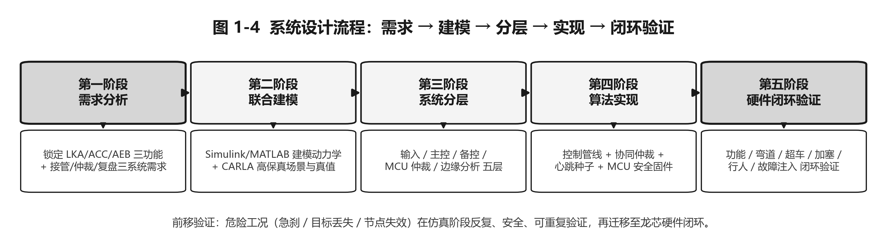

〔图 1-4　系统设计流程：需求分析 → 联合建模 → 系统分层 → 算法实现 → 硬件闭环验证五阶段，仿真前移、证据回灌迭代〕

---

## 第二部分　系统组成及功能说明

### 2.1　整体介绍

系统按"输入—计算—安全—执行—复盘"五层组织，层与层之间以明确的数据流、安全职责和可观测证据衔接，如图 2-1 所示。① **联合仿真输入层**——Simulink/MATLAB 建模车辆动力学与控制律，CARLA 提供高保真三维交通场景与感知真值，二者以约 20 Hz 同步步进，验收时检查场景帧和车辆状态；② **边缘计算控制层**——龙芯 2K1000LA 主控 SoC 以 100 Hz 运行 LKA/ACC/AEB 控制内核并在同节点完成本地机器学习分析，备用 SoC 运行同构控制栈作热备，验收时检查控制周期、SEQ、控制状态种子和 KPI；③ **安全仲裁层**——独立 FreeRTOS MCU 承担 CRC 校验、来源仲裁与看门狗兜底，验收时检查 SRC0/SRC1/SRC9 和错误帧处理；④ **执行输出层**——转向、制动、驱动，验收时检查最终控制命令；⑤ **边缘分析与展示层**——KPI、风险事件、NVMe 日志、HDMI 展示与 MQTT 上云，验收时检查复盘数据是否能重算关键指标。这一分层把"被控对象从哪来、控制谁来算、命令谁来裁、异常谁来兜、证据谁来留"逐层划清，是后续硬件、软件与安全设计的共同骨架。

主备接管功能正是这五层协同的代表：联合仿真层持续给主、备 SoC 提供同一车辆状态；主控 SoC 正常输出控制帧并广播 SEQ/控制状态种子；备控 SoC 监听心跳、识别静默或 SEQ 停滞，并在接管边沿继承主控最后一帧状态；MCU 不理解上层算法，只按控制帧新鲜度执行“主控优先、主控超时切备控、双路失效看门狗制动”；边缘分析层记录故障注入时刻、SRC0/SRC1/SRC9 切换、加速度阶跃、最小间距和碰撞结果。因此，接管优化不是单点算法，而是跨越备控健康检测、SoC 控制连续性、MCU 来源仲裁和实验证据留存的系统功能。

| 系统层 | 在主备接管中的职责 | 对应效果 |
|---|---|---|
| 联合仿真输入层 | 给主、备控制栈提供同一车辆状态和交通场景 | 故障注入可重复，接管前后行为可对比 |
| 主控 SoC | 100 Hz 输出 LKA/ACC/AEB 控制帧，并广播 SEQ 与控制状态种子 | 提供可继承的最后有效控制状态 |
| 备控 SoC | 检测心跳静默/SEQ 停滞，接管时继承横纵向平滑状态 | 发现假活，避免第一帧从零初始化 |
| Safety MCU | 按新鲜度和来源选择 SRC0/SRC1/SRC9 | 接管发生在执行端，双路失效仍能安全制动 |
| 边缘复盘层 | 记录时延、阶跃、看门狗、最小间距和碰撞 | 557→156→47 ms 的收益可追溯 |

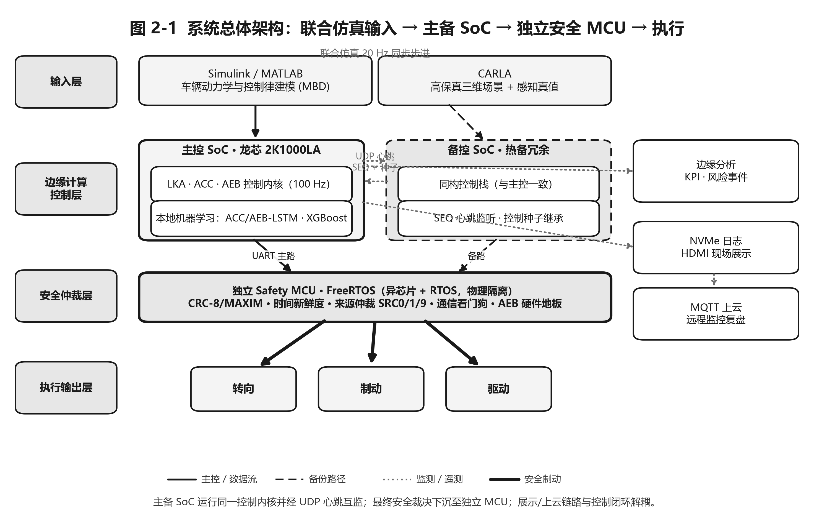

〔图 2-1　系统总体架构：联合仿真输入 → 主备 SoC 边缘控制 → 独立安全 MCU 仲裁 → 底盘执行，右侧为与控制闭环解耦的边缘分析/展示/上云链路。实线为主控数据流、虚线为备份路径、点线为监测/遥测、粗线为安全制动〕

数据自联合仿真模型进入主控 SoC，主、备 SoC 以 100 Hz 运行同一控制内核并经 UDP 心跳互监；控制帧经 UART 下发至 FreeRTOS MCU，由 MCU 完成 CRC、来源仲裁与看门狗裁决后输出最终执行命令。与此同时，龙芯 SoC 把遥测与事件交由本地机器学习小模型实时分析，沉淀 KPI 与风险证据；该展示/上云链路为异步旁路，不参与实时闭环，故网络抖动不影响车辆控制。系统启动顺序为：先起联合仿真模型，再起主控 SoC，随后备控 SoC，最后 FreeRTOS MCU（或虚拟 MCU），确保数据自场景层贯通至执行层，形成面向真车的硬件在环闭环。

### 2.2　硬件系统介绍

#### 2.2.1　硬件整体介绍

硬件系统由龙芯 2K1000LA 主控 SoC、Jetson Nano 副控 SoC、FreeRTOS Safety MCU、供电模块、通信线束、显示与调试外设组成。整体硬件按“主控计算—备控辅助—安全仲裁—执行输出—数据展示”的链路组织，便于评委从实物连接直接对应到系统控制流程。

龙芯 2K1000LA 作为第一控制节点，负责 LKA/ACC/AEB 实时控制、本地机器学习辅助分析、控制帧生成、KPI 统计和日志留存；Jetson Nano 作为热备冗余与边缘辅助节点，负责主控心跳监听、备路控制帧输出、MQTT 上云、Web 数据转发和非实时展示服务；FreeRTOS Safety MCU 位于最靠近执行端的位置，负责主/备两路控制帧的 CRC 校验、来源仲裁、AEB 硬件地板和通信看门狗兜底；供电与线束模块为各节点提供电源、UART、以太网、HDMI、USB 和调试连接。硬件验收时重点检查 100 Hz 控制周期、主备 SRC 切换、CRC 错帧丢弃、看门狗制动、NVMe 日志和 HDMI 展示结果。

**龙芯 2K1000LA 主控板（第一控制节点）。** 龙芯 2K1000LA 是本系统的 ADAS 核心主控 SoC 与边缘计算平台，承担 LKA/ACC/AEB 控制闭环的实时决策、控制帧生成与执行调度，并运行 100 Hz 实时控制内核。除规则控制任务外，主控板还集成 ACC-LSTM、AEB-LSTM 与 XGBoost 等轻量机器学习模型，用于前车接近趋势分析、碰撞风险评估、临界场景预警和 KPI 复盘。机器学习输出只作为保守增强信号参与上层协同仲裁，不替代规则控制器，也不绕过 Safety MCU 直接控制执行器。

在实物接线方面，龙芯主控板通过千兆网口接入联合仿真局域网，接收 Simulink/MATLAB＋CARLA 输出的车辆状态、场景真值与实时遥测数据；通过 HDMI 视频线连接显示器，输出车辆状态、风险指标、机器学习判险结果和实验 KPI；通过 40Pin 扩展排针引出两组 UART TX/RX 信号，其中一组用于向 FreeRTOS Safety MCU 下发主控控制帧，另一组用于调试、备用通信或外部节点交互。UART 接线采用交叉连接方式，即主控 TX 接对端 RX、主控 RX 接对端 TX，并与 MCU 或外部节点保持 GND 共地。NVMe SSD 用于存储运行日志、故障事件、KPI 文件、机器学习推理结果和实验证据；USB 接口用于键鼠、串口调试器或外设接入；Expand IO 用于状态灯、按键和告警扩展。

**Jetson Nano 副控板（热备冗余与边缘辅助节点）。** Jetson Nano 副控板承担备用 SoC 与边缘辅助节点双重角色。作为热备节点时，它运行与龙芯主控一致的 LKA/ACC/AEB 控制栈，通过 UDP 心跳接收主控角色、SEQ 序号、控制状态种子、AEB 状态与健康信息；当检测到主控静默、进程退出或控制周期停滞时，继承最近一帧控制状态种子并输出备路控制帧，降低接管瞬间转向角、纵向加速度和 AEB 状态突变。当前配合 SEQ 停滞检测、控制状态继承与 35/58 ms 安全时序工作点，主备接管时延约为47 ms。

**ESP-IDF 仲裁 MCU（独立安全域节点）。** 仲裁 MCU 是本系统最靠近执行器的安全域节点，负责把主、备 SoC 的控制建议转化为经过校验、仲裁和兜底后的最终执行命令。固件基于 ESP-IDF/FreeRTOS 实现，任务包括 UART 接收、控制源选择、执行输出和通信看门狗监测。龙芯主控与 Jetson 副控分别通过独立串口链路向 MCU 发送控制帧，帧内包含转向角 DELTA、纵向加速度或制动命令、AEB 状态、来源编号、SEQ 序号和 CRC 校验字段。MCU 逐帧执行 CRC-8/MAXIM 校验、时间新鲜度判断和来源有效性检查，只接受格式正确、校验通过且未超时的控制命令。

仲裁逻辑遵循“有效主控优先、主控失效备控接管、双路失效安全制动”的原则：系统正常运行时执行龙芯主控帧；主控帧超时、SEQ 停滞或主控进程异常时切换到 Jetson 备控帧；主、备两路均无有效控制帧时，由通信看门狗触发安全制动。AEB 硬件地板独立叠加在来源选择之后，即使上位节点给出较弱制动，只要 AEB 条件成立，MCU 仍可提高制动强度。该设计将最终执行裁决从 Linux/ROS2 控制节点下沉到独立实时 MCU，降低单一 SoC、单一进程或网络链路异常导致危险输出的风险。

**边缘分析与 MQTT 上云平台（学习型辅助层）。** 边缘分析与 MQTT 上云平台由龙芯主控 SoC 与 Jetson Nano 协同完成，用于风险评估、KPI 统计、运行证据生成和远程展示。平台读取逐帧遥测数据，运行 ACC-LSTM、AEB-LSTM、AEB-XGBoost 等轻量模型，输出加速度前馈建议、风险类别、风险概率峰值和关键事件标签，并将结果写入本地日志、JSONL 文件或通过 MQTT 发布到 Web 展示端。该平台只提供预警增强和数据复盘能力，不替代规则控制器，不直接控制执行器。后续优化重点包括模型推理延迟评估、Jetson 与龙芯之间的数据延迟测试、长时间 MQTT 稳定性测试、CPU/内存/温度记录以及网络中断后的本地缓存与补发机制。

#### 2.2.2　机械设计介绍

机械结构采用开放式展示底板设计，将龙芯 2K1000LA 主控 SoC、Jetson Nano 副控板、FreeRTOS Safety MCU、供电模块、交换机、显示与调试接口集中布置在同一平台上。该结构面向比赛现场演示、评审核验和真车前装样机迁移前的接口验证，重点突出硬件节点职责、线束连接关系和安全链路可追踪性，而不是封闭式车规外壳。

在布局上，平台按“联合仿真输入—主控计算—备控辅助—MCU 安全仲裁—执行输出—数据展示”的顺序布置。龙芯主控板位于核心区域，便于连接网口线、HDMI 视频线、40Pin UART 通信线、USB 调试线和供电线；Jetson Nano 靠近主控板布置，用于热备接管、MQTT 上云和边缘辅助展示；Safety MCU 靠近执行输出端布置，突出其独立安全域定位；供电模块与交换机分区放置，减少电源线、网线和串口线交叉。

在线束与维护方面，各类连接按照功能分为电源线、以太网线、串口通信线、HDMI 显示线和 USB 调试线，并通过标签标识接口名称、信号方向和连接对象。主控与 MCU、备控与 MCU 的 UART 接线采用 TX/RX 交叉连接并保持共地。底板预留板卡固定孔位和走线空间，关键节点采用螺丝、铜柱或扎带固定，复位键、串口调试口、USB、网口、HDMI 和供电接口保持外露，便于现场快速接线、排查和重启。

在散热与供电方面，主控 SoC、副控板和供电模块之间保留间距，高发热器件布置在通风区域，便于增加散热片或小型风扇；供电线束与信号线束尽量分区走线，降低电源噪声和线缆缠绕对调试的影响。当前机械结构能够满足比赛展示、硬件闭环验证和短时间连续演示需求，但仍需进一步完善外壳防护、线束防呆、抗振固定、风道设计、长期散热验证、供电保护和电磁兼容设计。

#### 2.2.3　电路各模块介绍

底盘域电路按"主备计算、独立仲裁、底盘执行、数据留存"四部分组织。主控 SoC 负责 100 Hz LKA/ACC/AEB 控制计算，备用 SoC 通过 UDP 心跳监听主控状态，并在心跳静默或 SEQ 停滞时接管。主、备两路均通过 UART 向 Safety MCU 发送控制帧，帧内包含 TTC、距离、PSI、DELTA、速度、加速度、AEB 状态和 CRC。该链路的验收方式是查看双路帧是否同时存在、CRC 错误帧是否被丢弃、主控帧过期后 MCU 是否切到备控帧。

Safety MCU 是底盘域的安全边界。它不直接信任上位 SoC 输出，而是先检查控制帧 CRC 与时间戳新鲜度，再按"主控优先、备控接管、双路失效看门狗制动"的规则选择最终来源，并叠加 AEB 硬件地板。执行侧只接收 MCU 仲裁后的转向、制动和驱动命令；数据侧由龙芯 SoC 同步写入 NVMe，并通过 HDMI 展示 KPI、风险状态和故障事件，便于现场调试与赛后复盘。

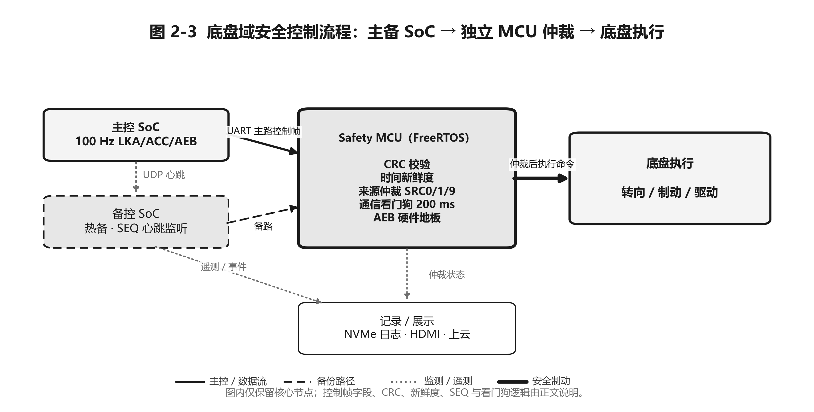

〔图 2-3　底盘域安全控制流程图：图内只保留主控 SoC、备控 SoC、Safety MCU、底盘执行与记录展示五类核心节点，详细帧字段和仲裁规则由正文说明〕

### 2.3　软件系统介绍

#### 2.3.1　软件整体介绍

软件由龙芯主控 SoC 控制程序、备 SoC 控制程序、FreeRTOS MCU 固件、Simulink/MATLAB 建模工程与 CARLA 场景、虚拟 MCU 与本地机器学习小模型模块组成。主控程序负责控制、组帧、心跳、协同仲裁、本地机器学习分析与 KPI；备控程序监听心跳并接管；MCU 固件负责 UART 收发、CRC、来源仲裁与看门狗；Simulink/MATLAB 负责车辆动力学与控制律建模、CARLA 负责高保真三维场景与感知真值驱动，二者联合仿真；虚拟 MCU 在 PC 端复现真实 MCU 安全逻辑。软件验收不依赖口头说明，而依赖同一场景可回放、同一日志可重算、同一故障可重复注入、同一控制栈可在离线/仿真/硬件三条路径复用。

#### 2.3.2　软件各模块介绍

软件可分为"SoC 控制栈、机器学习辅助、物联网上云"三组，分别对应实时控制、学习型辅助与异步复盘。

**SoC 控制栈。**

- **控制管线（核心）**：读取车辆状态、道路航向、前车状态与跨周期记忆，依次执行 LKA→ACC→AEB→限幅→平滑→串口编码，输出转向角、纵向加速度、AEB 状态与遥测；验收时检查输入状态、输出帧和控制周期。
- **LKA**：依据横向偏差、航向误差、曲率前馈与边界保护生成转向命令；验收时检查横向 RMS、发散状态和弯道前瞻限速前后对比。
- **ACC**：依据前车距离、相对速度、安全时距与目标速度计算纵向加速度，引入**基于车距的接近速度封顶**；验收时检查接近静止前车的速度曲线和最终停距。
- **AEB**：依据 TTC、安全距离、目标类别与确认计数分级制动，并在危险时覆盖 ACC；验收时检查目标类别、触发拍数、制动命令和误触发次数。
- **协同仲裁（新增）**：将 ACC、AEB、行人制动、车道边界制动、机器学习预警五个纵向需求按"最保守者胜"统一合并，并以"安全停车所需减速度"门控 TTC-AEB；验收时检查各需求源和最终采纳源。
- **主备心跳**：主控广播 SEQ 与控制状态种子，备控继承平滑状态接管；验收时检查 SEQ 停滞、接管首帧和 SRC 切换。
- **FreeRTOS MCU 固件**：RX/Control/TX/Watchdog 四任务，把最终安全裁决放在最靠近执行器一端；验收时检查 CRC、帧新鲜度、来源仲裁和看门狗输出。

**关键算法与公式说明（供实验核验）。**

本节只保留能支撑实验结论、能由日志复算、能解释安全边界的公式。评审可用 CSV 日志中的车速、车距、相对速度、横向误差、控制源和风险输出复核这些量。符号约定：`v` 为自车速度，`d` 为前向目标距离，`v_rel = v_ego - v_obj` 为接近速度（大于 0 表示正在接近），`e_y` 为横向偏差，`e_psi` 为航向误差，`kappa` 为道路曲率，`L` 为等效轴距，`dt` 为控制周期。

整套实时控制管线可概括为“先横向、再纵向、最后安全仲裁”。下面的伪代码用于说明控制顺序，不展开具体函数内部实现，避免正文变成源码说明书。

```python
lat_cmd = lateral_control(ego_state, lane_state, preview_curve)
acc_cmd = acc_control(ego_v, lead_distance, lead_speed, target_speed)
aeb_cmd = aeb_guard(ego_v, lead_distance, lead_speed, object_class)
ml_cmd = conservative_ml_assist(risk_prob)

lon_cmd = min(acc_cmd, aeb_cmd, pedestrian_cmd, lane_boundary_cmd, ml_cmd)
frame = encode_control_frame(seq, lon_cmd, lat_cmd, aeb_state)
send_to_mcu(frame)
```

这段代码保留的原因是它能说明两条总原则：第一，纵向命令由最保守需求决定；第二，机器学习只作为保守增强输入，不能绕过规则 AEB、限幅或 MCU 看门狗。

1. **LKA 横向控制公式：说明转向命令从哪里来。**

横向控制由弯道曲率前馈、航向误差、横向偏差和横向误差变化率组成。该公式用于解释 LKA 如何把车辆拉回车道中心，也用于说明后续横向 RMS 指标为什么能评价车道保持效果。

$$
\begin{aligned}
\delta_{ff} &= \arctan(L\kappa) \\
\dot e_y &= \frac{e_y(k)-e_y(k-1)}{dt} \\
\delta_{raw} &= \delta_{ff}+K_{\psi}e_{\psi}+K_y e_y+K_d\dot e_y \\
\delta_{cmd} &= \mathrm{clip}(\delta_{raw},-\delta_{max},\delta_{max})
\end{aligned}
$$

其中，`delta_ff` 提前补偿弯道曲率，`K_psi e_psi` 抑制车头朝向误差，`K_y e_y` 修正车辆相对车道中心的偏移，`clip` 表示执行器转角限幅。该公式直接对应日志中的横向误差、航向误差、曲率和最终转角命令。

2. **弯道前瞻限速：说明为什么目标设到 144 km/h 仍可过弯有界。**

弯道前瞻限速不是提高横向控制器本身的开环极限，而是在进弯前用曲率限制纵向速度，使车辆不超过侧向加速度能力。

$$
\begin{aligned}
a_y &= v^2|\kappa| \\
v_{curve} &= \sqrt{\frac{a_{y\_max}}{\max(|\kappa_{preview}|,\varepsilon)}} \\
v_{ref} &= \min(v_{set},v_{curve})
\end{aligned}
$$

其中，`kappa_preview` 是预瞄窗口内的风险曲率，`a_y_max` 是允许侧向加速度上限。该公式用于解释 144 km/h 目标车速下的稳定结果：系统并不是硬扛高速过弯，而是提前把实际速度压回横向控制器可承受范围。

**机器学习辅助（学习型辅助）。**

- **本地机器学习小模型分析**：龙芯 SoC 实时运行 ACC-LSTM/AEB-LSTM/XGBoost，输出加速度前馈与风险类别，并记录 KPI、风险事件与证据；输出只允许向更保守方向并入协同仲裁。

**物联网云平台（MQTT 异步上云）。** 云平台把边缘侧处理后的运行结果发布到云端，形成远程监控与赛后复盘链路。链路以 CSV/JSONL 遥测为输入，由边缘计算程序提取车速、车距、TTC、AEB 状态、仲裁来源、机器学习风险、控制命令和场景标签等字段，整理为结构化消息后通过 MQTT 发布；云端或本地订阅端可按时间顺序查看车辆状态、风险变化、故障事件与接管过程，把"本地能跑"扩展为"远程可看、数据可查、事件可追溯"。该链路不参与实时闭环控制、不改变 MCU 安全裁决、不影响主控 100 Hz 周期：网络异常时本地控制继续运行、消息缓存为 JSONL 后补发，网络正常时云端实时展示 KPI、风险预警与故障注入结果——控制安全链路与展示上云链路彻底解耦，通信抖动不会波及车辆控制。

**一体化演示与验证控制台（一键统一入口）。** 上述各模块原本以独立脚本分散在不同子目录，演示与复现需要逐一切换目录、记忆命令行参数。为降低评审复现与现场演示的门槛，本作品提供一个一键启动的统一控制台（仓库根目录 `平台控制台.py` + `启动控制台.bat`，双击即用），用中文菜单把全部功能收敛为一个入口：① CARLA 实景 ADAS 演示（超车 / 加塞 / 行人 / ACC / 全功能含主备接管）；② 双冗余联合仿真（CARLA × 真实 SOC 控制栈、SIL 链路自检、双 SoC 主备控制台、接管时延极限实验、KPI 报告）；③ SOC 控制栈离线回归（场景回放、遥测回放、pytest、兼容性检查）；④ 边缘机器学习（演示 / 训练 / 评估 / 导出 ONNX / 推理基准）；⑤ 边缘计算与上云（KPI/事件 JSONL、MIL 性能）；⑥ Web 实时监控台；⑦ 文档配图一键生成与报告打开；⑧ 各子系统测试套件与 SIL 降级回归；⑨ CARLA 仿真器集中管理（启动 / 关闭 / 渲染画质）。控制台本体为纯 Python 标准库、零第三方依赖，统一托管 CARLA 仿真器生命周期，并提供 `--check` 非交互自检逐项校验所有功能入口是否就绪。它把"系统能跑"进一步落实为"全部实验证据一键可复现"，与本作品强调的"运行证据可复盘"工程目标一致。

**CARLA 实景循环演示发行版（面向现场展示，开箱即跑、跨机可移植）。** 为满足比赛现场连续演示与异机展示的需要，CARLA 实景演示包（超车 / 加塞 / 行人 / ACC 四工况）进一步封装为一键循环演示发行版：双击启动器即按设定顺序无限轮播四个功能场景，**每个场景独立启停一份 CARLA 实例**（每个实例只加载一次地图，规避反复切换地图带来的稳定性风险），任一场景超时或异常自动隔离并续跑、演示不中断；在没有仿真器的机器上自动降级为内置 Web 驾驶舱演示。发行版自动检测并从随包文件安装本地推理依赖、自动发现仿真器路径，全部展示参数（场景顺序、单场景时长、画质、是否带画面、是否开 Web、循环轮数）集中在一个文本配置文件中，**更换演示电脑无需改动代码**。此外，该演示包的横向控制引入**弯道前瞻限速**：按当前车速预瞄前方道路曲率，在进弯之前预先降速，把过弯侧向加速度约束在设计上限内，从而在高速环路上保持车道居中与过弯稳定。该发行版与统一控制台一并服务"现场可连续展示、异机可复现"的交付目标。


---

## 第三部分　完成情况及性能参数

### 3.1　整体介绍

第三部分只报告能够被复查的完成情况。系统已形成"联合建模仿真→龙芯主控计算→MCU 仲裁→机器学习分析→展示复盘"的工程闭环：龙芯主控 SoC 运行 LKA/ACC/AEB 并同步完成本地机器学习分析；车辆行为在联合仿真中闭环运行；控制命令进入 MCU 仲裁链路；故障注入可触发主备接管或看门狗制动；结果以 CSV、JSONL、截图、曲线和统计摘要留存。整机由龙芯主控 SoC、备 SoC、FreeRTOS MCU、供电与通信线束组成，配合 Simulink/MATLAB＋CARLA 联合仿真或硬件闭环运行。

〔图 3-1　整机正面/斜 45° 实物照片，排版时补入〕

### 3.2　工程成果

本节先给出工程成果的可证明性，再列交付物。评委不需要仅凭文字相信系统已经做成，而可以沿着"实物/界面可见、数据日志可查、故障注入可复现、指标口径可验收"四类证据核对每一项成果。工程成果的证明对象不是单个截图，而是完整闭环：控制节点是否真实运行，执行端是否独立裁决，故障是否能被主动注入，结果是否能由日志和指标重复得到。

| 证明对象 | 已交付内容 | 可检查证据 | 验收口径 |
|---|---|---|---|
| 硬件闭环存在 | 龙芯主控 SoC、备用 SoC、FreeRTOS MCU、供电与通信线束组成的开放式硬件展示平台 | 节点实物、接口连接、供电状态、主备通信与 MCU 接收状态 | 现场可指出每个硬件节点的职责，控制链路可从 SoC 追踪到 MCU |
| 控制链路贯通 | LKA/ACC/AEB 控制帧从龙芯 SoC 输出，经主备链路进入 MCU 仲裁 | 双路控制帧日志、CRC 校验结果、来源仲裁状态、AEB 地板状态 | 正常时主控优先，主控失效时备控接管，双路失效时 MCU 进入安全制动 |
| 联合仿真可复现 | Simulink/MATLAB＋CARLA 场景闭环、虚拟 MCU 与真实 MCU 两套验证路径 | 超车、加塞、行人、静止前车、主控失效等场景回放与日志 | 同一场景可重复触发相同行为，关键指标能由日志重新计算 |
| 软件工程可交付 | 一键控制台、循环演示发行版、无 CARLA 单元测试套件 | `启动控制台.bat`、`平台控制台.py`、演示配置、测试输出 | 可一键进入演示、自检、回归和证据生成 |

#### 3.2.1　机械成果

机械成果不是封闭外壳，而是服务于评审验证和真车迁移前调试的开放式硬件展示平台。平台把龙芯主控 SoC、备用 SoC、FreeRTOS MCU、供电模块和通信线束集中布置，接口外露、节点可见、状态可查，便于现场沿着"主控计算→备控监听→MCU 仲裁→安全输出"逐点核对。该形态牺牲了外观包覆，但强化了可证明性：每根线束、每个通信端口、每个节点职责都能在演示时直接对应报告中的系统架构。

可验证证据包括：整机正面/斜 45° 实物照片、节点标签、主备 SoC 与 MCU 的连接关系、供电状态、故障复位方式。验收口径是：评委能够在实物上找到报告中描述的关键节点，并能看到故障注入、主备接管和 MCU 兜底不是纯软件动画，而是落在明确硬件节点上的闭环行为。当前仍需完善的部分是外壳防护、线束固定、接口标签统一化与长期散热记录；这些属于工程封装问题，不影响本阶段硬件闭环的验证成立。

#### 3.2.2　电路成果

电路成果的核心是把"能发命令"升级为"命令来源可判定、错误帧可拒绝、通信失效可降级"。系统已贯通 `SoC→MCU` 控制链路、主备 UDP 心跳链路、龙芯 NVMe 存储链路、HDMI 显示链路和 5V 供电链路。MCU 接收主控/备控双路帧后执行 CRC 校验、来源仲裁、AEB 硬件地板和通信看门狗；主备 SoC 通过心跳与 SEQ 状态保持角色同步；龙芯 SoC 在控制同时输出边缘分析、KPI 与展示数据。

可验证证据包括：双路控制帧日志、CRC 校验通过/失败记录、来源切换状态、AEB 触发状态、看门狗超时状态和主备心跳时间戳。验收口径是：注入错误帧时 MCU 拒绝执行；杀掉主控时备控接管并保持控制连续；主备双路静默时 MCU 在约 200 ms 量级进入安全制动。当前仍需补充统一载板、防呆接口、过流保护、真实执行器闭环和供电纹波长期数据；这些将提升真车封装可靠性，但现阶段电路链路已经能证明执行端安全裁决成立。

#### 3.2.3　软件成果

软件成果的交付重点是可复现，而不是只提供一次性演示脚本。系统已实现龙芯控制栈、备控程序、FreeRTOS MCU 固件、联合仿真控制台、虚拟 MCU、本地机器学习模块和指标生成模块。LKA/ACC/AEB 可在 CARLA 联合仿真场景运行；主备热切换可演示主控失效、恢复和双控失效；MCU 与虚拟 MCU 可验证 CRC、来源仲裁、AEB 地板和通信看门狗；龙芯端可生成 KPI、风险事件与日志证据。每一类演示均保留可回放数据，使结果能从日志重新计算，而不是停留在屏幕观感。

工程化交付上，系统提供一键启动的统一控制台（`启动控制台.bat` / `平台控制台.py`，纯标准库、零依赖），用中文菜单把实景 ADAS 演示、双冗余联合仿真、SIL 接管自检、SoC 离线回归、机器学习、边缘计算上云、Web 监控台、配图生成与测试套件收敛为一个入口，并集中管理 CARLA 仿真器，配 `--check` 自检逐项校验入口。评审与现场演示无需记忆分散命令，即可一键进入演示、回归和证据生成。

面向现场展示与跨机复现，CARLA 实景演示包封装为一键循环演示发行版：双击后按序无限轮播超车、加塞、行人、ACC 四类工况，每个场景独立启停 CARLA，异常自动隔离续跑；无仿真器时自动降级为 Web 驾驶舱演示，展示参数集中在文本配置中，换机无需改代码。软件质量方面，安全关键控制模块（纵向 ACC/AEB、横向 LKA、超车状态机与"最保守者胜"纵向仲裁）配套无 CARLA 单元测试套件作为回归护栏，纯标准库、可在任意机器秒级运行，覆盖弯道前瞻限速、AEB 触发与释放、超车状态迁移等行为。验收口径是：改动控制参数后能立即回归验证；换机演示时能从统一入口复现报告中的核心工况；生成的日志、KPI 和配图能支撑第三部分后续性能指标。

〔图 3-2　联合仿真控制台与边缘分析界面，排版时补入〕

### 3.3　特性成果

> 本节的实测数据说明：超车 / 加塞 / 行人 / ACC-AEB 协同仲裁等成对对比场景仍取自 CARLA 联合仿真（Town04，2026-06-16 采集）；车道保持速度边界与 LKA/ACC/AEB 三功能稳定性则在本次定稿用**真实 SOCCode 控制内核**（与联合仿真、龙芯部署同一 `run_pure_pipeline`）在**纯 Python SIL**（自行车模型世界端 + 弧长投影感知）上**重新扫描刷新**，每个工作点做多次随机扰动重复试验取均值，以替换早期较粗的离散采样数据。下方每张图均在正文逐一说明，不单独堆放。

**LKA 车道保持（速度稳定边界刷新）。** 基于航向误差、横向偏差、曲率前馈与边界保护的转向控制。本次在一条 R=200 m 的高速弯道上对目标车速 36→144 km/h 做扫描，每点跑 6 次带随机初始偏移、初始航向误差与感知噪声的重复试验取平均。稳定性判据沿用横向误差 RMS ≤0.5 m 且 ≥10 s 无发散振荡——该 0.5 m 不是物理常数，而是评价控制性能的工程边界。**关闭弯道前瞻限速**让横向控制器直接承受目标车速时，84 km/h 的 RMS 仅 0.10 m、96 km/h 为 0.27 m，108 km/h 恰好触及 0.50 m 判据线，120 km/h 升到 0.71 m；按 RMS=0.5 m 在 96 与 120 km/h 间线性插值得到经验临界速度 **V_crit≈108 km/h**。值得强调的是，即便目标车速继续升到 144 km/h，6 次重复试验仍 **0 次发散、横向偏移峰值始终 <0.9 m（车辆全程在车道内）**——也就是说超过 V_crit 后系统表现为跟踪精度优雅降级，而非失稳。该 108 km/h 相比早期基于 CARLA 演示栈（ADAS_Central / Town04）插值得到的约 78 km/h 保守估计有明显提升，原因是本次直接用部署级 SOCCode 控制内核而非演示栈、并采用更规整的等曲率高速弯道；它仍是经验稳定边界，依赖控制器增益、道路曲率、采样周期与执行限幅，不应被理解为车辆物理最高速度。

**弯道前瞻限速带来的边界提升。** 系统出厂态启用**弯道前瞻限速**后，纵向层按当前车速预瞄前方道路曲率，在进弯之前把车速降到横向控制器能力范围内，使横向控制器始终工作在其裕度之内。同一条弯道、同一套扫描下启用前瞻限速：从 36 一直到 **144 km/h（本次扫描上限）目标车速，稳态横向误差 RMS 全部稳定在约 0.13 m、0 次越界**，把原本在 120 km/h 已超界的工作点全部拉回有界；代价是过弯时实际速度被曲率封顶（在 R=200 m 弯段降到约 21 m/s），即"可设车速可以很高、过弯实际均速受限"。因此弯道前瞻限速并不改变横向控制器的开环极限，而是确保整车在任意设定车速下都不超过该极限，把车道保持可用的目标车速范围由约 108 km/h 进一步放宽到至少 144 km/h 全程车道有界。该机制属于横向稳定性的纵向保障，与第三项创新中"安全方向优先"的协同仲裁同源；前后对比数据见 `成果/数据/lane_keeping_sweep_raw.csv`（关闭前瞻）与 `lane_keeping_sweep_lookahead.csv`（启用前瞻），扫描脚本为 `仿真/experiment_lane_keeping_sweep.py`。

如图 3-3 所示，整页四联子图为上述结论：(a) 是 RMS-目标车速边界曲线，实线（关闭前瞻）在约 108 km/h 越过 0.5 m 判据线、点划线标出 V_crit，虚线（启用前瞻）则在全速段贴地平稳，每点的误差带来自 6 次重复试验，带宽极窄说明结论可重复；(b) 是同一弯道上 72 / 108 / 132 km/h 三档**车道保持行驶轨迹（车线路）**叠在车道中心线上，可见车辆全程贴线行驶；(c) 是横向偏移-时间折线（均值±带），72 km/h 紧贴 0、108 km/h 稳定在判据线附近、132 km/h 越过判据线但不发散；(d) 是车速-时间折线，对比 108 km/h 目标下"关闭前瞻"直接拉到约 105 km/h 与"启用前瞻"进弯自动降速的两条曲线，直观解释前瞻限速的工作方式。

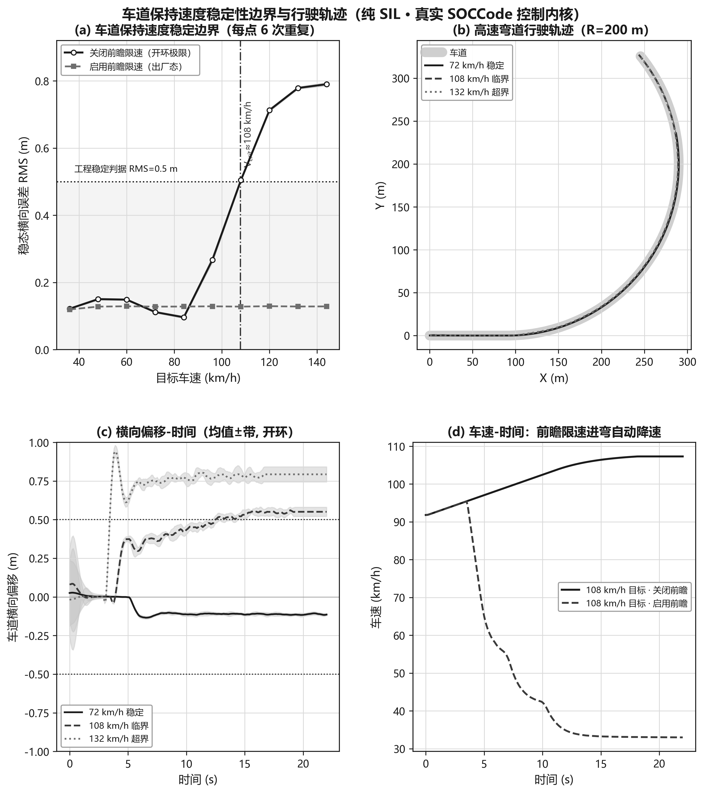

〔图 3-3　车道保持速度稳定性边界与行驶轨迹（纯 SIL、真实 SOCCode 控制内核、每点 6 次重复取平均）：(a) RMS-车速边界与 V_crit≈108 km/h；(b) 高速弯道行驶轨迹；(c) 横向偏移-时间均值±带；(d) 前瞻限速进弯自动降速的车速-时间对照〕

**LKA / ACC / AEB 三功能运行稳定性（重复试验取平均）。** 为回答"三个核心功能反复运行是否稳定"，对每个功能各做 8 次带随机扰动的 SIL 重复试验、在公共时间网格上取均值±标准差带：LKA 取高速弯道 72 km/h 车道保持，ACC 取 90 km/h 巡航接近并跟随一辆约 54 km/h 的慢速前车，AEB 取约 72 km/h 接近一辆静止前车的紧急制动稳停。如图 3-4 所示：(a) LKA 8 条偏移曲线高度重合、RMS≈0.10 m、峰值 <0.2 m、0 越界，说明车道保持在随机初始扰动下高度可重复；(b) ACC 自车从约 90 km/h 平滑减速到与前车一致的约 54 km/h、车距收敛到约 33 m 的安全时距，8 次试验带宽窄、无"加速—急刹"抖动；(c) AEB 自车单调减速直至稳停，8 次随机初速/初距下**最小间距稳定在约 10.2 m、0 碰撞**。三幅折线共同证明 LKA/ACC/AEB 在重复运行下均稳定、可复现。

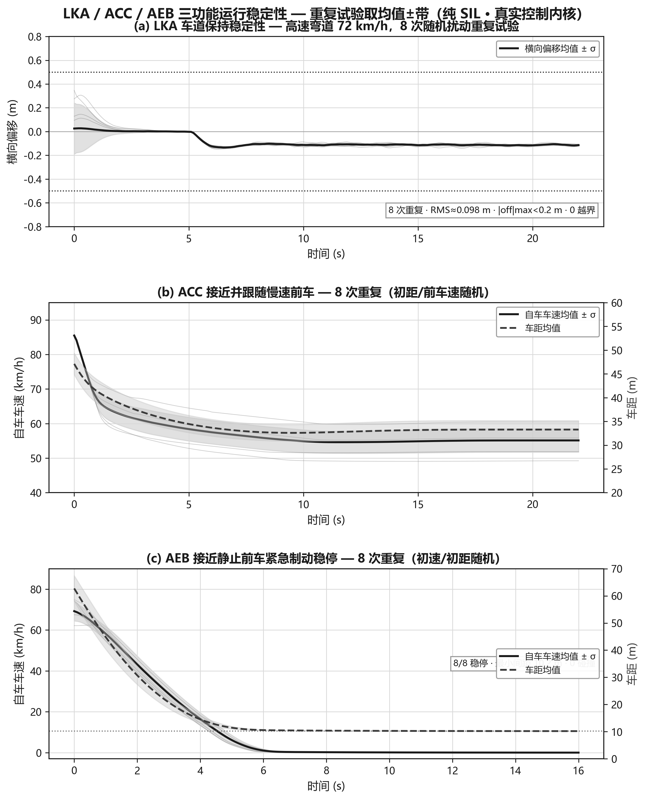

〔图 3-4　LKA / ACC / AEB 三功能运行稳定性，每功能 8 次随机扰动重复试验取均值±带（纯 SIL、真实控制内核）：(a) LKA 高速弯道横向偏移-时间；(b) ACC 车速/车距-时间；(c) AEB 车速/车距-时间稳停〕

**ACC 自适应巡航。** 基于前车距离、相对速度、安全时距与目标速度的纵向控制，并引入基于车距的接近速度封顶，可在前车变速、慢车与静止前车场景平滑跟随并稳定停车；其重复试验稳定性已见图 3-4(b)。

**AEB 自动紧急制动 + 协同仲裁（核心成果）。** 在接近正前方静止车的实测中，关闭协同仲裁与受控接近门控的基线方案因原始 TTC 阈值反复触发，AEB 误触发达 **57 次**、车辆"蠕动—急刹"始终无法驶达；启用"协同仲裁 + 受控接近门控"后，AEB 误触发降为 **0 次**，车辆单调平滑驶近并稳停于约 5.9 m（≈ 期望停距），同时真正的近距离紧急制动仍无条件保留。该结果直接证明了 ACC/AEB 不再打架。图 3-5 给出 480 帧同长度逐帧对比：上方为基线方案的车速/车距/AEB 触发曲线（反复急刹、蠕动卡在约 17 m），下方为本系统（单调平滑驶近、稳停约 5.9 m、AEB 触发计数为 0），两条曲线并排即可读出 57→0 的差异来源。

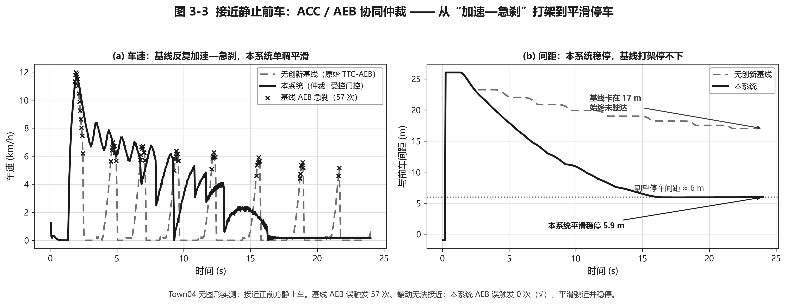

〔图 3-5　接近静止前车：无创新基线 AEB 误触发 57 次、蠕动卡 17 m 驶不达 vs 本系统 0 次误触发、平滑稳停 5.9 m（CARLA 联合仿真，480 帧同长度对比）〕

**超车 / 加塞 / 行人三大工况。** CARLA 联合仿真实测（Town04）：超车场景下自车减速停于静止前车后，触发"确认→左变道→超越→回正"完整状态机；加塞场景下相邻车道车辆并入瞬间被识别为前车，自车以 ACC/AEB 平滑减速保距而非误判为静止车去绕行；行人横穿场景下自车巡航接近、识别横穿后制动避让。三大工况行为正确、相互不干扰。图 3-6 把三类场景的车速、车距与关键状态（变道偏移 / 前车在道 / 行人告警）按时间轴并排，可逐段核对各功能触发时机与彼此不干扰。

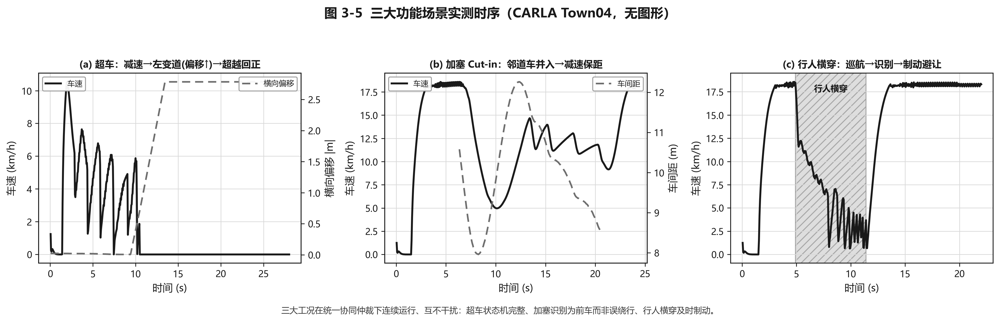

〔图 3-6　超车 / 加塞 / 行人三大工况实测时序（CARLA 联合仿真），三大功能在统一仲裁下连续运行、互不干扰〕

**主备热切换。** 该成果对应“备控健康检测 + SoC 控制连续性 + MCU 来源仲裁”三层协同。原基线只靠 0.5 s 心跳静默判故障，主控被杀后 3 次接管空窗为 547 / 547 / 578 ms，代表值约 557 ms；加入 SEQ 后，备控不仅能发现主控掉线，还能发现心跳仍在但控制循环停滞的假活，接管时继承主控最后一帧 `DELTA/ACC/AEB/CLS` 控制状态种子，使首帧输出不再从零开始，HB 80 ms / MCU 150 ms 配置下接管空窗降至 156 ms，加速度阶跃降至约 0.07 m/s²。随后成对下压心跳超时、MCU 主控失活仲裁和备控轮询阈值，并开启备控热待机，让备控在待命状态也持续向 MCU 提交备路帧；当前落地工作点为心跳超时 35 ms、MCU 仲裁 58 ms、备控心跳轮询 5 ms，典型接管约 47 ms，接管瞬间加速度阶跃 ≤0.01 m/s²。110 次极限扫描确认最小稳定配置可到心跳 33 ms / 仲裁 52 ms，健康期零误接管、接管期零碰撞、最小间距始终 ≥46 m；备控热待机把可用段 >2 m/s² 冲击从 8/100 降至 0/100。相关三级递进证据已见图 1-1。

**MCU 安全兜底。** CRC 校验、来源仲裁、AEB 硬件地板与通信看门狗，双路静默约 200 ms 触发安全制动；机制与看门狗兜底实测见图 1-2。

**机器学习小模型。** 机器学习部分不直接替代 LKA/ACC/AEB 规则控制器，而是作为龙芯 SoC 上的学习型辅助层，为纵向控制提供预测和风险补盲。系统集成三类轻量模型：ACC-LSTM 使用 20 帧历史车距、车速、相对速度、加速度和时距，预测下一阶段更平滑的加速度建议；AEB-LSTM 使用 20 帧 TTC、DRAC、THW 和接近速度等风险序列，输出 safe / warning / emergency 三类风险状态；AEB-XGBoost 使用单帧与滞后统计特征做低延迟风险分类。模型以 ONNX 形式在边缘侧本地推理，输出只允许向更保守方向影响协同仲裁，即可以增加预警或附加制动需求，但不能放松规则 AEB、MCU 看门狗或主备冗余保护。

实测结果表明，ACC-LSTM 在 NGSIM 轨迹子集上 MAE 为 0.460 m/s²、RMSE 为 0.668 m/s²、R² 为 0.449；相比"默认未来加速度为 0"的无预测基线，RMSE 由 0.901 降至 0.668，误差降低 **25.9%**。AEB 风险识别方面，AEB-LSTM 验证准确率为 **81.5%**，safe / warning / emergency 三类召回率分别为 83.0% / 72.0% / 77.7%；AEB-XGBoost 验证准确率为 **87.1%**，三类召回率分别为 88.5% / 78.8% / 79.8%。在加塞等规则 AEB 尚未触发的临界工况中，机器学习风险输出可提前出现约 0.99 的风险峰值，作为学习型冗余预警补充规则阈值的盲区。该设计强调机器学习"可关闭、可旁路、可解释、只保守增强"：规则层负责确定性安全边界，机器学习负责预测与预警，MCU 负责最终执行仲裁。如图 3-7 所示，加塞并线瞬间规则 AEB 尚未触发，本地机器学习的风险概率已先行抬升到约 0.99，为协同仲裁提供提前一拍的保守预警。

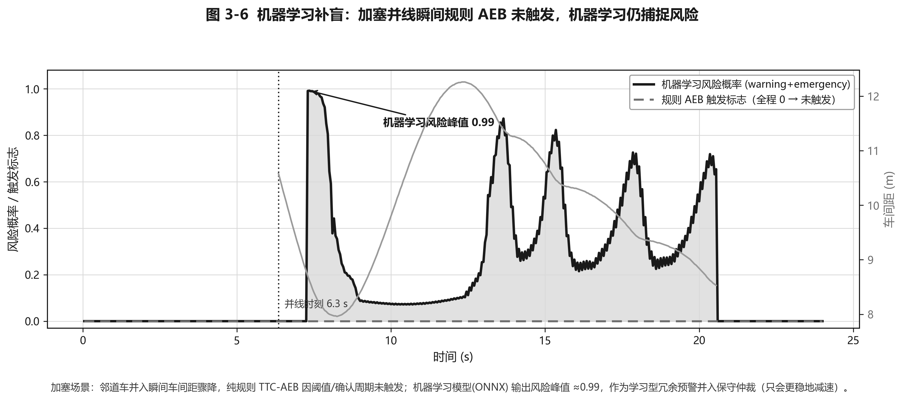

〔图 3-7　加塞并线瞬间规则 AEB 未触发，本地机器学习仍捕捉到风险峰值约 0.99，作为学习型冗余预警并入保守仲裁〕

**成果图表与数据沉淀。** 本次定稿所依据的成果材料集中存放于“成果”目录：“数据”目录包含接近静止前车基线、本系统接近静止前车、超车、加塞、行人 5 组 CARLA 逐帧 CSV，以及本次新增的车道保持速度扫描两组 `lane_keeping_sweep_raw/lookahead.csv` 和三功能重复试验 `three_function_trials.json`；图 3-3～3-7 及 1.5 节三张创新点证据图、图 1-1 接管时延极限扫描图均由 `文档/龙芯定稿/` 下的绘图脚本（含本次新增 `gen_part3_experiments.py`）从上述数据生成，避免用不同弱基线造成不公平对比。此外主备接管阈值的 110 次极限扫描另有结论：接管时延已贴 100 Hz 链路量化地板（中位约 47 ms、最快单次 15 ms）、最小稳定配置可至心跳 33 ms / 仲裁 52 ms、全程 0 碰撞，并经备控热待机把可用段接管窗 >2 m/s² 冲击从 8/100 降为 0/100。

### 3.4　主要性能参数

- **控制实时性**：100 Hz 控制管线，约 10 ms/周期；验收依据为 SoC 遥测时间戳和控制帧周期统计。
- **联合仿真输入**：Simulink/MATLAB＋CARLA 同步约 20 Hz，SoC 侧插入 100 Hz 控制环；验收依据为场景帧、车辆状态和控制输入对齐记录。
- **冗余安全**：主备可靠无感接管约 47 ms（旧优化配置约 156 ms，原基线约 557 ms）；验收依据为故障注入时刻、SRC 切换、接管空窗、加速度阶跃和最小间距。
- **执行安全**：双路静默约 200 ms 进入看门狗制动，AEB/看门狗最大制动命令 9.99 m/s²；验收依据为 MCU 看门狗状态和最终制动命令。
- **AEB 协同仲裁**：接近静止前车误触发 57→0，稳停约 5.9 m；验收依据为 480 帧接近实验、AEB 触发计数和最终距离。
- **车道保持**：横向控制器开环稳定边界按 RMS=0.5 m 插值约 108 km/h（早期演示栈估计约 78 km/h，本次用真实 SOCCode 控制内核刷新），扫至 144 km/h 仍 0 发散、全程在车道内（优雅降级）；启用弯道前瞻限速后，目标车速扫至 144 km/h（本次扫描上限）仍全程车道有界（横向 RMS≈0.13 m，进弯自动降速、过弯实际均速受限）；验收依据为纯 SIL 高速弯道速度扫描（每点 6 次重复取平均）CSV 与前瞻限速前后对比。
- **本地机器学习**：ACC-LSTM RMSE 0.668 m/s²（↓25.9%），AEB LSTM/XGB 准确率 81.5%/87.1%；验收依据为训练/验证划分、评价指标和加塞场景风险峰值。
- **成果数据**：形成 5 组 CARLA 逐帧 CSV、2 组车道保持速度扫描 CSV（关闭/启用前瞻）、1 份三功能重复试验 JSON 实测数据，配套三张创新点证据图、两张本次新增的整页实验图（车道保持速度边界与轨迹、三功能稳定性重复试验）、若干 PNG 对比图和 1 张接管时延极限扫描图，覆盖主备接管、MCU 仲裁、Class-Aware AEB、ACC/AEB 仲裁、车道保持速度边界与轨迹、三功能运行稳定性、三大功能场景、机器学习风险预警和冗余接管阈值边界。
- **数据留存**：以 CSV、JSONL、截图、曲线与统计摘要保存；验收时可由原始数据重新生成关键图表。

---

## 第四部分　总结

### 4.1　可扩展之处

后续扩展不以堆叠功能数量为目标，而以保持现有核验口径为约束：新增传感器、执行器、算法或上云模块后，仍必须能说明输入来源、控制责任、执行边界、故障兜底和复盘证据。本系统采用模块化、分层解耦的软硬件架构，可在保持龙芯 SoC 主控与独立安全控制单元职责边界清晰的前提下，向实车辅助驾驶验证平台逐步扩展。

在感知输入层，系统可进一步接入摄像头、毫米波雷达、CAN 总线及 V2X 通信设备，将当前 Simulink/MATLAB 与 CARLA 提供的仿真环境数据逐步替换为实车采集数据。验收口径应从“能接入”提升为“时间戳可对齐、目标状态可追踪、异常输入可回放”，实现从虚拟场景验证到真实道路数据验证的平滑迁移。

在控制功能层，可在现有 ACC、AEB 与 LKA 功能基础上，扩展变道辅助、障碍物绕行、路口通行及复杂交通流下的纵横向协同控制策略。新增功能必须通过统一状态接口接入现有主备冗余与安全仲裁机制，并给出触发条件、优先级、降级行为和日志字段。

在边缘智能层，可依托龙芯 SoC 的本地计算与数据管理能力，扩展运行状态统计、驾驶风险评估、传感器异常检测及轻量化机器学习模型推理功能。验收边界保持不变：模型只能提供预警、解释和保守增强，不能绕过规则控制和 MCU 仲裁；同时预留模型参数更新、离线训练结果部署和日志回传接口，为后续算法迭代提供支撑。

在执行验证层，系统可由当前仿真执行对象逐步扩展至舵机、电机、制动器等实物执行机构，并进一步测试控制指令传输延迟、执行响应误差、故障接管时延及闭环控制精度。新增实物执行器后，必须保留“错误帧拒绝、主备切源、双路失效制动、AEB 地板”四项执行端核验。

无论功能规模如何扩展，系统始终保持“实时控制独立、安全兜底独立、边缘分析独立”的分层设计原则：龙芯主控负责控制计算与边缘分析，独立安全控制单元负责故障仲裁与安全降级，从结构上保证新增功能不会削弱既有安全边界。

### 4.2　心得体会

本作品的工程复盘结论是：面向真车的 ADAS 系统不能只证明“功能能跑”，还必须证明“输入可追踪、控制可复现、执行可拒错、失效可降级、结果可复盘”。设计之初，团队先锚定 LKA/ACC/AEB 三项核心功能，以基于模型的设计方法用 Simulink/MATLAB 建模被控对象与控制律、CARLA 构建高保真场景进行联合仿真，将危险工况前移到仿真阶段反复验证，从而为后续硬件部署建立可信基础。

在平台选型上，龙芯 2K1000LA 的工程价值体现在可核验的边缘闭环能力：它在 100 Hz 实时控制的同时承载本地机器学习小模型在线推理，使系统不止于"控制代码演示"，而能将运行过程转化为现场可见的指标、曲线与日志。配合 FreeRTOS MCU 将最终安全裁决下沉至执行端，系统获得了独立于上位控制的安全冗余层；该结论由控制周期、KPI 输出、故障注入和 MCU 来源仲裁记录共同支撑。

软件层面的工程结论集中在两点。

**其一是控制内核复用带来的验证一致性。** 离线回放、联合仿真与硬件部署三条路径共用同一套 LKA/ACC/AEB 控制逻辑，测试结论可互相印证。评审核验时可用同一场景输入对比三条路径的控制输出，规避"仿真跑通、上车失效"的典型陷阱。

**其二是多功能 ADAS 仲裁必须用反例验证。** 开发中期，ACC 与 AEB 在接近静止前车时出现"加速—急刹"冲突。排查结果表明，根因不在 ACC 调速逻辑，而在 AEB 的原始 TTC 阈值设计：接近任何静止目标时，TTC 必然单调跌破阈值，误触发不可避免。最终以"最保守者胜 + 安全停车所需减速度门控"统一仲裁，将误触发从 57 次降至 0 次，且不削弱真正的紧急制动响应。该结论由基线与改进方案同场景对比得出，说明多功能 ADAS 的安全不只在于各模块单独正确，更在于模块间具备清晰、可解释、可复查的优先级与仲裁规则。

在机器学习集成策略上，系统将机器学习设计为可关闭、可旁路、可解释的辅助层，以 ONNX 格式在龙芯本地实时推理，且仅允许其向更保守方向影响决策。验收原则是：机器学习只能收紧安全边界，不能放宽安全边界；规则 AEB、通信看门狗和 MCU 仲裁始终保留最终安全权限。

当前作品在实车感知闭环、真实执行器测试与长期温升验证等方面仍有提升空间。现阶段能够交付的确定结论是：系统已形成"有模型、有控制、有冗余、有安全、有机器学习、有证据"的 ADAS 闭环验证平台，并且每项核心结论都有对应的故障注入、日志或指标支撑。

回头审视，系统真正的工程门槛不在单点指标，而在跨层协同与失效模式的预判。以主备接管为例，单纯缩短心跳超时并不能保证无感切换；只有打通"SoC 假活检测—控制状态种子继承—MCU 仲裁时序"完整链路，才能发现真正的瓶颈：ESP32 对主控帧过期的仲裁阈值，以及"备控帧必须先于 MCU 判过期到达"这一隐性时序边界。继续压低参数不会无限缩短接管，反而会触发健康期误接管或接管窗全力制动冲击；备控热待机正是针对这一竞态边界的工程修正。类似地，MCU 独立仲裁解决的是执行端能否拒绝错误命令，Class-Aware AEB 与机器学习软融合解决的是规则安全与学习型风险提示如何共存。三项设计共同把故障检测、控制连续性、执行裁决和风险判别连成一条可验证链路。

最终结论可以由评委按证据链复查：本作品的核心价值在于把龙芯 SoC 的实时控制与本地机器学习、备控热待机、FreeRTOS MCU 独立安全裁决和联合仿真证据链贯通起来，使系统每一次控制、接管、制动和预警都有明确来源、执行边界和复盘数据。

---

## 第五部分　参考文献

[1] SAE International. Taxonomy and Definitions for Terms Related to Driving Automation Systems for On-Road Motor Vehicles: SAE J3016[S]. 2021.
[2] ISO. Road vehicles — Functional safety: ISO 26262[S]. Geneva: International Organization for Standardization, 2018.
[3] ISO. Road vehicles — Safety of the intended functionality: ISO 21448[S]. Geneva: International Organization for Standardization, 2022.
[4] Koopman P, Wagner M. Challenges in Autonomous Vehicle Testing and Validation[J]. SAE International Journal of Transportation Safety, 2016, 4(1): 15-24.
[5] The MathWorks. Model-Based Design with Simulink and MATLAB[Z]. Natick, MA, 2023.
[6] Dosovitskiy A, Ros G, Codevilla F, et al. CARLA: An Open Urban Driving Simulator[C]//Conference on Robot Learning. 2017: 1-16.
[7] Rajamani R. Vehicle Dynamics and Control[M]. New York: Springer, 2012.
[8] Paden B, Cap M, Yong S Z, et al. A Survey of Motion Planning and Control Techniques for Self-driving Urban Vehicles[J]. IEEE Transactions on Intelligent Vehicles, 2016, 1(1): 33-55.
[9] Chen T, Guestrin C. XGBoost: A Scalable Tree Boosting System[C]//Proc. 22nd ACM SIGKDD. 2016: 785-794.
[10] Hochreiter S, Schmidhuber J. Long Short-Term Memory[J]. Neural Computation, 1997, 9(8): 1735-1780.
[11] U.S. DOT, FHWA. Next Generation Simulation (NGSIM) Vehicle Trajectories Dataset[Z].
[12] The FreeRTOS Project. FreeRTOS Real-Time Kernel Reference Manual[Z].
[13] Loongson Technology. Loongson 2K1000LA Processor and Development Board Technical Documentation[Z].
[14] Loongson Technology. LoongArch Reference Manual, Volume 1: Basic Architecture[Z].
[15] Loongson Technology. LoongArch Reference Manual, Volume 2: Vector Extensions[Z].
[16] Loongson Technology. LoongArch ELF psABI Specification and Toolchain Conventions[Z].
[17] Loongson Technology. Loongson 7A1000 Bridge User Manual[Z].
